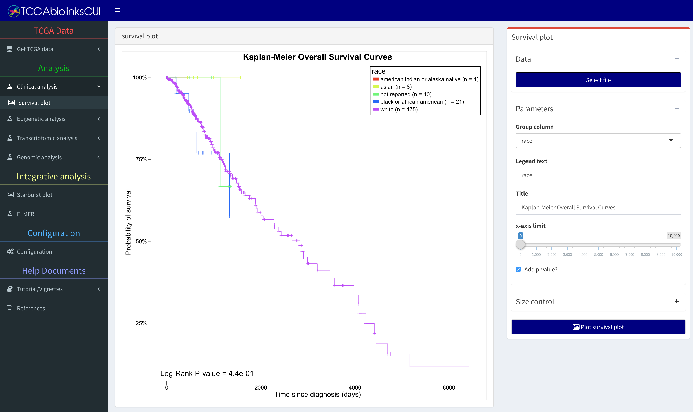
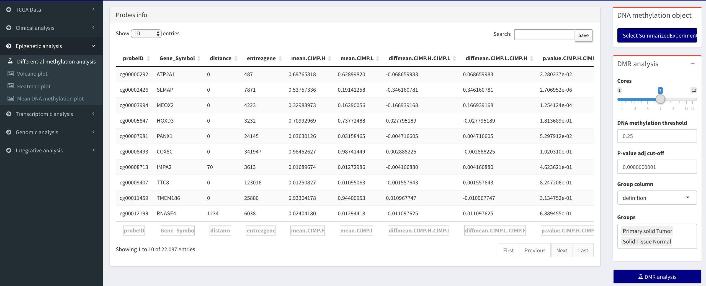
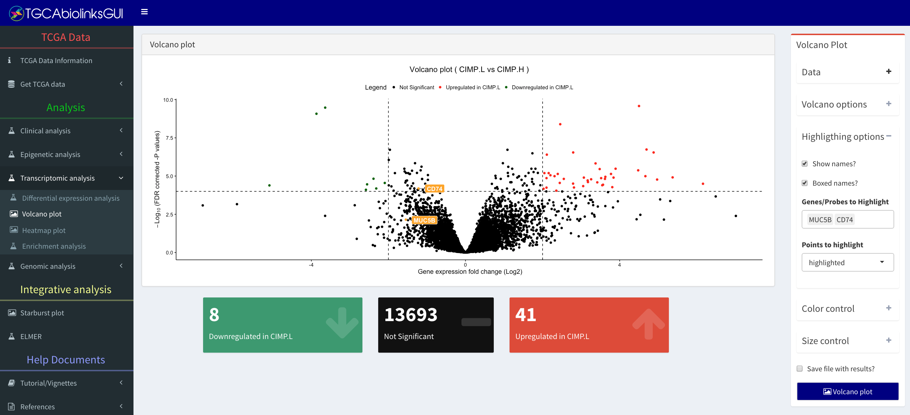
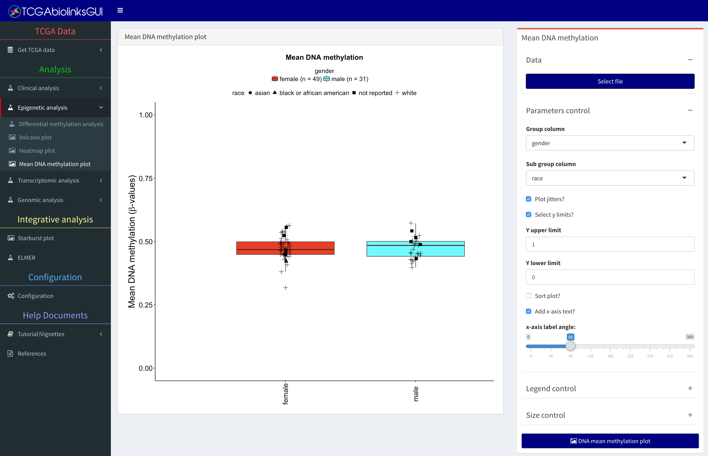
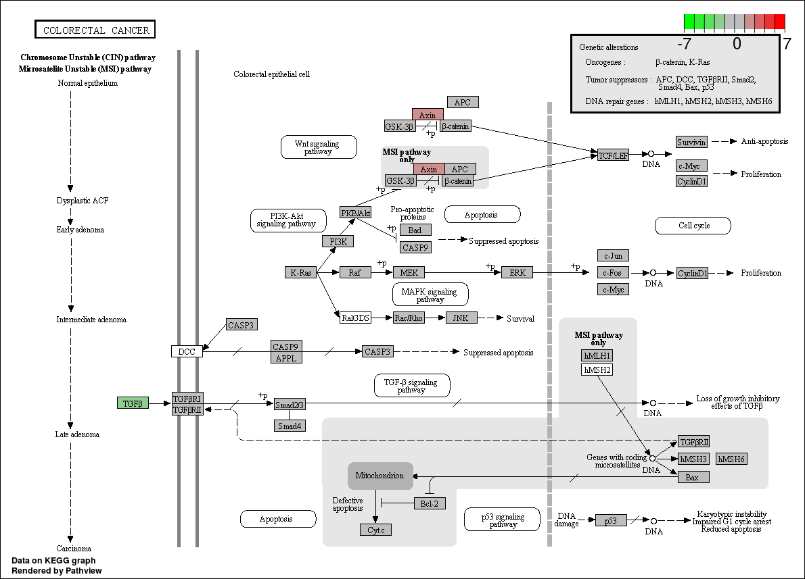
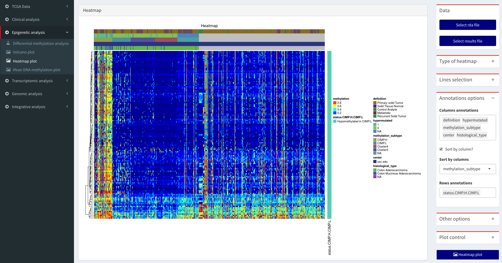
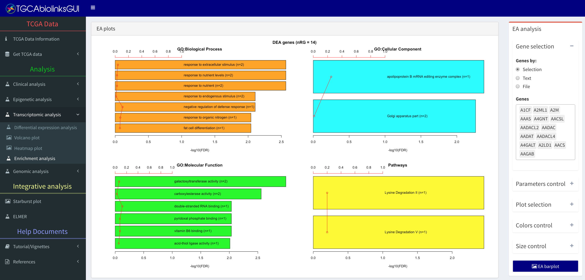
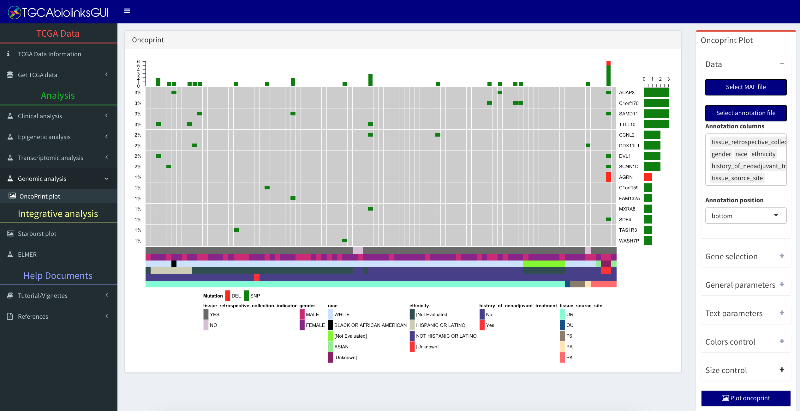

# Detailed explanation

For a detailed manual for this section please access these links:

1. [Clinical analysis menu manual](https://drive.google.com/drive/folders/0B0-8N2fjttG-U1dyZ2g2VEhFXzQ?usp=sharing)
2. [Epigenetics analysis menu manual](https://drive.google.com/drive/folders/0B0-8N2fjttG-N3k0SWZua1RGTW8?usp=sharing)
3. [Transcriptomic analysis menu manual](https://drive.google.com/drive/folders/0B0-8N2fjttG-cGF3SkFac2lueFk?usp=sharing)
4. [Genomic analysis menu manual](https://drive.google.com/drive/folders/0B0-8N2fjttG-TEx6MjBfY0p4dE0?usp=sharing)

# Menu: Clinical analysis

## Sub-menu: Survival plot
Users can access the clinical data download in the TCGA data menu to verify the survival of different groups.

### Data 
A csv or R object (rda) file with the clinical information.

### Parameters 

* Group column: Select the column that identifies the group of each sample.
* Legend text: Text of the legend.
* Title: Title text.
* x-axis limit: Limits the x-axis. If 0, no cut-off is considered.
* Add p-value: Add p-value to the plot.

### Size control
Changes the size of the plot

# Menu: Manage summarized Experiment object

To facilitate visualization and modification of the SummarizedExperiment object, we created this menu in which it is possible to visualize the three matrices of the object (assay matrix [i.e. gene expresssion values], features matrix [i.e. gene information] and sample information matrix). Also,  it is possible to download the sample information matrix as a csv file, and, after modifying it, to upload  and update the SummarizedExperiment object. This might be useful if for example the user wants to compare two groups not already pre-defined.

")

**Tutorial Video:** Managing a SummarizedExperiment object - (http://www.youtube.com/watch?v=54NBug9ycwM)

# Menu: Epigenetic analysis

## Sub-menu: Differential methylation analysis

The user will be able to perform a Differential methylation regions (DMR) analysis.
The output will be a file with the following pattern: DMR_results_GroupCol_group1_group2_pcut_1e-30_meancut_0.55.csv
Also, the summarized Experiment will be saved with all the results inside it and the new object will be saved with _result suffix.

Obs: Depending on the number of samples and the number of probes of interest, this analysis can last anywhere from minutes to days.  Duration of the analysis also depends on the type of machine and hardware on which it is run.

### Data

Select a summarized Experiment object (rda)

### Parameters control

* Cores: Selects the number of cores to be used in the analysis
* DNA methylation threshold: minimum difference of DNA methylation levels to be considered as hyper/hypomethylated
* P-value adj cut-off: minimum adjusted P-value to be considered as significant.
* Group column: columns with the groups to be used in the analysis
* Groups: Select at least two groups for analysis. For example if it has three groups (g1, g2 and g3) the analysis will
output g1 vs g2, g1 vs g3 and g2 vs g3.

## Sub-menu: Volcano plot

In this sub-menu the user will be able to plot the results from the Differentially methylated regions (DMR) 
analysis and the differential expression analysis (DEA). 

### Data 
Expected input a csv file with the following pattern:

* For expression: DEA_results_Group_subgruop1_subgroup2_pcut_0.01_logFC.cut_2.csv
* For DNA methylation: DMR_results_Group_subgruop1_subgroup2_pcut_1e-30_meancut_0.55.csv

### Volcano options
This box will control the x-axis thresholds "Log FC threshold" for expression and "DNA methylation threshold" for DNA methylation and the y-axis thresholds "P-value adj cut-off".

### Highlighting options

Checkbox option:

* Show names: Shows the names of up/down regulated genes or hypo/hyper methylated probes 
* Boxed names: Put names inside a box.
To highlight specific genes/probes consider using the "Highlighting option."

The option "points to highlight" can perform the following functions:

* Highlighted - Shows the names for only the highlighted genes/probes list
* Significant - Shows the names for only the up/down regulated genes or hypo/hyper methylated probes 
* Both - Shows both groups

### Color control
Change the color of the plot

### Size control
Change the size of the plot

### Other 

* Save file with results: Create a file with the same pattern as the one in the input, but with the new thresholds.

## Sub-menu: Mean DNA methylation plot

In this sub-menu the user will be able to plot the mean DNA methylation by groups.

### Data
Expected input is an R object (rda) file with a summarized Experiment object.

### Parameters control

* Groups column: Select the column that will split the data into groups. 
This column is selected from the  sample matrix (accessed with colData)

* Subgroups column: Select the column that will highlight the different subgroups data in the groups. 
* Plot jitters: Show jitters
* Select y limits: Set lower/upper limits for y
* Sort method: Methods to sort the groups in the plot
* x-axis label angle: Change angle of the text in the x-axis

### Size control
Change the size of the plot

# Menu: Transcriptomic analysis
In this sub-menu the user will be able to perform a gene ontology enrichment analysis for the following processes:
biological, cellular component, and molecular function. In addition, a network analysis for the groups of genes will be performed.

## Sub-menu: Differential expression analysis

### Gene expression object box

Select a summarized Experiment object (rda)

### Normalization of genes

Using the `TCGAanalyze_Normalization` function you can normalize mRNA transcripts and miRNA, using EDASeq package. 
This function uses Within-lane normalization procedures to adjust for GC-content effect (or other gene-level effects) on read counts: 
loess robust local regression, global-scaling, and full-quantile normalization [@risso2011gc] and between-lane normalization procedures 
to adjust for distributional differences between lanes (e.g., sequencing depth): global-scaling and full-quantile normalization [@bullard2010evaluation].

* Normalization of genes? 
* Normalization of genes method? Options: gcContent, geneLength

### Quantile filter of genes

* Quantile filter of genes?
* DEA test method: quantile, varFilter, filter1, filter2
* Threshold selected as mean for filtering

### DEA analysis

* Log FC threshold: Log2FoldChange  threshold
* P-value adj cut-off: significant threshold
* Group column: group column in the summarized Experiment object
* Group 1: Group 1 for comparison
* Group 2: Group 2 for comparison
* DEA test method: options glmRT, exactTest

After the analysis is completed, the results will be saved into a csv file.
The **Delta** column shown in the results is: $$\delta = |log{FC}| \times |mean (group 1) - mean (group 2)|$$.

### Pathway graphs

* DEA result: Select csv file create by the analysis.
* Pathway ID: plot results in a pathway graphs. See bioconductor [Pathview](http://bioconductor.org/packages/pathview/) [@luo2013pathview] package.

")

**Tutorial Video:** Visualizing DEA results using pathview graphs - (http://www.youtube.com/watch?v=MtEVe7_ULlQ)

## Sub-menu: Heatmap plot

### Data

* Select R object (rda) file: Should receive a summarized Experiment object
* Results file: Should receive the output from the DEA or DMR analysis.

DEA result file should have the following pattern: DEA_result_groupCol_group1_group2_pcut_0.05_logFC.cut_0.csv
DMR result file should have the following pattern:  DMR_results_groupCol_group1_group2_pcut_0.05_meancut_0.3.csv

### Genes/Probes selection

* By status: Based on the results file the user can select to see hyper/hypo methylated probes
* Text: The user can write a list of genes separated by ";" , "," or a new line

### Annotation options

* Columns annotation: using the data in the summarized experiment the user can annotate the heatmap.
* Sort by column: The order of the columns can be sorted by one of the selected columns
* Row annotation: Add annotation to rows

### Other options

* Scale data: option "none", "by row","column"
* Cluster rows 
* Cluster columns 
* Show row names 
* Show col names 

### Size control
Change the size of the plot and the number of bars to plot

### Sub-menu: Enrichment analysis

To better understand the underlying biological processes, researchers often retrieve a functional profile of a set of genes that might have an important role. This can be done by performing an enrichment analysis.

Given a set of genes that are up-regulated under certain conditions, an enrichment analysis will identify classes of genes or proteins that are over or under-represented using gene set annotations.

### Gene selection
Input a list of genes by:

* Selection: The user can select by hand multiple genes from a list
* Text: the user can write a list of genes separated by ";" , "," or a new line
* File: select a file (rda, csv, txt) with a column Gene_symbol or mRNA

### Parameter control

* Size of the text
* x upper limit: x-axis upper limit. If 0 no limit is used.
* Number of bar histograms to show: Maximum number of bars to plot

### Plot selection

* Plot Biological Process
* Plot Cellular Component
* Plot Molecular Function
* Plot Pathways

### Colors control
Change the color of the plot

### Size control
Change the size of the plot and the number of bars to plot

### Sub-menu: Network inference

Inference of gene regulatory networks. Starting with the set of differentially expressed genes, we infer gene regulatory networks using the following 
state-of-the art inference algorithms: ARACNE[@Mar06], CLR[@faith2007large], MRNET[@meyer2007information] and C3NET[@altay2010inferring]. These methods are based on mutual inference and use different heuristics 
to infer the edges in the network. These methods have been made available via Bioconductor/CRAN packages (MINET[@Meyer2008] and c3net[@altay2010inferring], respectively).

# Menu: Genomic analysis

## Sub-menu: Oncoprint

Using the oncoPrint function from the [ComplexHeatmap](http://bioconductor.org/packages/ComplexHeatmap/) package, this sub-menu offers a way to visualize multiple genomic alterations.

 and visualize through an oncoprint plot - (http://www.youtube.com/watch?v=cp1AwT8Ogmg)")

**Tutorial Video:** Download Mutation Annotation files (MAF) and visualize through an oncoprint plot - (http://www.youtube.com/watch?v=cp1AwT8Ogmg)

### Data

* Select MAF file: Select a MAF file (.rda) with mutation annotation information
* Select annotation file: Select an R object (rda)  with the metadata information. Columns labeled "patient" or "bcr_patient_barcode" should exist.
* Annotation columns: Which columns of the annotation file should be visible?
* Annotation position: Location of the annotation (e.g. Top or bottom).

### Gene selection

* Selection: The user can select multiple genes from a list
* Text: The user can write a list of genes separated by ";" , "," or a new line
* File: Select a file (rda, csv, txt) with a column Gene_symbol or mRNA

### Parameters control

* Remove empty columns? If a sample has no mutation, it will be removed from the plot 
* Show column names? Show patient barcodes?
* Show barplot annotation on rows? Show right barplot?

# References

