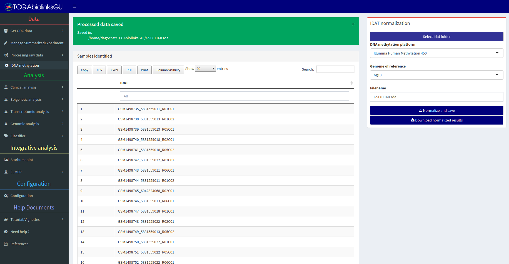

```{r message=FALSE, warning=FALSE, include=FALSE}
library(TCGAbiolinks)
library(SummarizedExperiment)
library(dplyr)
library(DT)
```
# Detailed explanation: Get GDC data menu

For a detailed manual for this section please access this link:
    
   1. [Data menu manual](https://drive.google.com/file/d/0B0-8N2fjttG-X1BoNlNnUnpVMWc/view?usp=sharing)

# Sub-menu: Molecular data

In this sub-menu, the user will be able to search, download and prepare The NCI's Genomic Data Commons (GDC)  data for analysis.
The first step is to search for GDC open data access with the Advanced search box. The search results will be summarized in plots in the center of the screen. The second step is to download and prepare the data into an R object 
to be used in the analysis steps.


##  Useful information

<div class="panel panel-info">
<div class="panel-heading">Different sources: Legacy vs Harmonized</div>
<div class="panel-body">


There are two available sources to download GDC data using TCGAbiolinks:
- GDC Legacy Archive: provides access to an unmodified copy of data that was previously stored in
[CGHub](https://cghub.ucsc.edu/) and in the TCGA Data Portal hosted by the TCGA Data Coordinating Center (DCC), in which uses
as references GRCh37 (hg19) and GRCh36 (hg18).
- GDC harmonized database: data available was harmonized against GRCh38 (hg38) using GDC Bioinformatics Pipelines
which provides methods to the standardization of biospecimen and
clinical data.

</div>
</div>


<div class="panel panel-info">
<div class="panel-heading">Understanding the barcode</div>
<div class="panel-body">

A TCGA barcode is composed of a collection of identifiers. Each specifically identifies a TCGA data element. Refer to the following figure for an illustration of how metadata identifiers comprise a barcode. An aliquot barcode contains the highest number of identifiers.

Example: 

- Aliquot barcode: TCGA-G4-6317-02A-11D-2064-05
- Participant: TCGA-G4-6317
- Sample: TCGA-G4-6317-02

For more information check [TCGA wiki](https://wiki.nci.nih.gov/display/TCGA/TCGA+barcode)
</div>
</div>

## Advanced search box


The following filters are available to select the data:

* Database
* Project filter
* Data category filter
* Data type filter
* Workflow filter
* Sample type filter
* Platform filter
* List of barcodes
* Clinical filter: gender, race, vital status, tumor stage.

<div class="panel panel-warning">
<div class="panel-heading">Repeated cases (barcodes) </div>
<div class="panel-body">

In the search step, it is important that there are no repeated 
cases, otherwise, the prepare step might not work. If it happens, the search will give you this warning "There are more than one file for the same case." 
To solve this problem, you probably need to use more filters to correctly select your data. 

As an example of this problem, if you use only Project (i.e "TCGA-ACC") and Data category filter (i.e "Copy Number Variation"), for each sample we have two data types "Copy Number segment"" and "Masked Copy Number segment". 

</div>
</div>


## Download & Prepare box

After the search step, the user can download the data and prepare it into an R object.
The data can be prepared into one of two formats:

* [SummarizedExperiment](http://www.nature.com/nmeth/journal/v12/n2/abs/nmeth.3252.html) 
[@huber2015orchestrating]: An R object that contains the sample information matrix (clinical and subtype information),
the assay matrix (i.e DNA methylation beta-values), the features matrix (i.e information for each probe in the DNA methylation assay matrix).
* Data Frame: A simple table with only the assay matrix (i.e Gene expression quantification)

In case a SummarizedExperiment object was selected the user will be able to add more metadata information into the sample information matrix. By checking "Add gistic2 and mutation information" and giving a list of genes,
the GUI will download GISTIC2 data from the GDAC Firehose and Mutation Annotation Files (MAF) and their information
to the object. This might be useful, for example, if the user wants to evaluate the survival of mutant samples vs non-mutant or if he wants to evaluate it on a heatmap, which can be used as labels.

Finally, the object will be saved with the same name as the file name field.

# Sub-menu: Subtype data

The Cancer Genome Atlas (TCGA) Research Network has reported integrated genome-wide 
studies of various diseases. We have added some of the subtypes defined by these
reports in our package.  


| TCGA dataset | Link                                                                 | Paper                                                                                                   | Journal          |
|--------------|----------------------------------------------------------------------|---------------------------------------------------------------------------------------------------------|------------------|
| ACC          | doi:10.1016/j.ccell.2016.04.002                                      | Comprehensive Pan-Genomic Characterization of Adrenocortical Carcinoma.                                 | Cancer cell 2016 |
| BRCA | https://www.ncbi.nlm.nih.gov/pmc/articles/PMC3465532/  | Comprehensive molecular portraits of human breast tumors | Nature 2013 |
| BLCA	| http://www.cell.com/cell/fulltext/S0092-8674(17)31056-5	| Comprehensive Molecular Characterization of Muscle-Invasive Bladder Cancer	Cell 2017 | 
| CHOL	| http://www.sciencedirect.com/science/article/pii/S2211124717302140?via%3Dihub	| Integrative Genomic Analysis of Cholangiocarcinoma Identifies Distinct IDH-Mutant Molecular Profiles |	Cell Reports 2017|
| COAD  | http://www.nature.com/nature/journal/v487/n7407/abs/nature11252.html | Comprehensive molecular characterization of human colon and rectal cancer  | Nature 2012      |
| ESCA  | https://www.nature.com/articles/nature20805 | Integrated genomic characterization of oesophageal carcinoma  | Nature 2017      |
| GBM          | http://dx.doi.org/10.1016/j.cell.2015.12.028                         | Molecular Profiling Reveals Biologically Discrete Subsets and Pathways of Progression in Diffuse Glioma | Cell 2016        |
| HNSC         | http://www.nature.com/nature/journal/v517/n7536/abs/nature14129.html | Comprehensive genomic characterization of head and neck squamous cell carcinomas                        | Nature 2015      |
| KICH         | http://www.sciencedirect.com/science/article/pii/S1535610814003043   | The Somatic Genomic Landscape of Chromophobe Renal Cell Carcinoma                                       | Cancer cell 2014 |
| KIRC         | http://www.nature.com/nature/journal/v499/n7456/abs/nature12222.html | Comprehensive molecular characterization of clear cell renal cell carcinoma                             | Nature 2013      |
| KIRP         | http://www.nejm.org/doi/full/10.1056/NEJMoa1505917                   | Comprehensive Molecular Characterization of Papillary Renal-Cell Carcinoma                              | NEJM 2016        |
| LIHC	| http://linkinghub.elsevier.com/retrieve/pii/S0092-8674(17)30639-6	| Comprehensive and Integrative Genomic Characterization of Hepatocellular Carcinoma |	Cell 2017 | 
| LGG          | http://dx.doi.org/10.1016/j.cell.2015.12.028                         | Molecular Profiling Reveals Biologically Discrete Subsets and Pathways of Progression in Diffuse Glioma | Cell 2016        |
| LUAD         | http://www.nature.com/nature/journal/v511/n7511/abs/nature13385.html | Comprehensive molecular profiling of lung adenocarcinoma                                                | Nature 2014      |
| LUSC         | http://www.nature.com/nature/journal/v489/n7417/abs/nature11404.html | Comprehensive genomic characterization of squamous cell lung cancers                                    | Nature 2012      |
| PAAD	 | http://www.cell.com/cancer-cell/fulltext/S1535-6108(17)30299-4 |	Integrated Genomic Characterization of Pancreatic Ductal Adenocarcinoma |	Cancer Cell 2017 |
| PCPG         | http://dx.doi.org/10.1016/j.ccell.2017.01.001                        | Comprehensive Molecular Characterization of Pheochromocytoma and Paraganglioma                          | Cancer cell 2017 |
| PRAD         | http://www.sciencedirect.com/science/article/pii/S0092867415013392   | The Molecular Taxonomy of Primary Prostate Cancer                                                       | Cell 2015        |
| READ         | http://www.nature.com/nature/journal/v487/n7407/abs/nature11252.html | Comprehensive molecular characterization of human colon and rectal cancer                               | Nature 2012      |
| SARC	| http://www.cell.com/cell/fulltext/S0092-8674(17)31203-5	| Comprehensive and Integrated Genomic Characterization of Adult Soft Tissue Sarcomas	| Cell 2017| 
| SKCM         | http://www.sciencedirect.com/science/article/pii/S0092867415006340   | Genomic Classification of Cutaneous Melanoma                                                            | Cell 2015        |
| STAD         | http://www.nature.com/nature/journal/v511/n7511/abs/nature13385.html | Comprehensive molecular characterization of gastric adenocarcinoma                                      | Nature 2013      |
| THCA         | http://www.sciencedirect.com/science/article/pii/S0092867414012380   | Integrated Genomic Characterization of Papillary Thyroid Carcinoma                                      | Cell 2014        |
| UCEC         | http://www.nature.com/nature/journal/v497/n7447/abs/nature12113.html | Integrated genomic characterization of endometrial carcinoma                                            | Nature 2013      |
| UCS	| http://www.cell.com/cancer-cell/fulltext/S1535-6108(17)30053-3 | 	Integrated Molecular Characterization of Uterine Carcinosarcoma	Cancer |  Cell 2017 | 
| UVM	| http://www.cell.com/cancer-cell/fulltext/S1535-6108(17)30295-7 |	Integrative Analysis Identifies Four Molecular and Clinical Subsets in Uveal Melanoma	| Cancer Cell 2017 |	


The user can visualize the table with the information and save it as CSV or R object (rda) file.

# Sub-menu: Clinical data

TCGAbiolinks has provided a few functions to search, download and parse GDC clinical data. 

## Useful information


<div class="panel panel-info">
<div class="panel-heading">Different sources</div>
<div class="panel-body">

In GDC database the clinical data can be retrieved from two sources:

- indexed clinical: a refined clinical data that is created using the XML files.
- XML files

There are two main differences:

- XML has more information: radiation, drugs information, follow-ups, biospecimen, etc. So the indexed one is only a subset of the XML files
- The indexed data contains the updated data with the follow-up information. 
For example: if the patient is alive in the first time clinical data was collect and the in the next follow-up he is dead, 
the indexed data will show dead. The XML will have two fields, one for the first time saying he is alive (in the clinical part) and the follow-up saying he is dead. You can see this case here: 

</div>
</div>

## Clinical data inconsistencies

<div class="panel panel-danger">
<div class="panel-heading">Clinical data inconsistencies</div>
<div class="panel-body">

Some inconsistencies have been found in the indexed clinical data and are being
investigated by the GDC team. These inconsistencies are:

- ***Vital status*** field is not correctly updated 
- ***Tumor Grade*** field is not being filled
- ***Progression or Recurrence*** field is not being filled

</div>
</div>

### Vital status inconsistencies

```{r results = 'hide', echo=TRUE, message=FALSE, warning=FALSE}
# Get XML files and parse them
clin.query <- GDCquery(project = "TCGA-READ", 
                       data.category = "Clinical", 
                       barcode = "TCGA-F5-6702")
GDCdownload(clin.query)
clinical.patient <- GDCprepare_clinic(clin.query, clinical.info = "patient")
clinical.patient.followup <- GDCprepare_clinic(clin.query, clinical.info = "follow_up")

# Get indexed data
clinical.index <- GDCquery_clinic("TCGA-READ")
```
```{r  echo = TRUE, message = FALSE, warning = FALSE}
select(clinical.patient,vital_status,days_to_death,days_to_last_followup) %>% datatable
select(clinical.patient.followup, vital_status,days_to_death,days_to_last_followup) %>% datatable
# Vital status should be the same in the follow up table 
filter(clinical.index,submitter_id == "TCGA-F5-6702") %>% select(vital_status,days_to_death,days_to_last_follow_up) %>% datatable
```

### Progression or Recurrence and Grade inconsistencies

```{r results = 'hide', echo=TRUE, message=FALSE, warning=FALSE}
# Get XML files and parse them
recurrent.samples <- GDCquery(project = "TCGA-LIHC", 
                              data.category = "Transcriptome Profiling",
                              data.type = "Gene Expression Quantification", 
                              workflow.type = "HTSeq - Counts",
                              sample.type = "Recurrent Solid Tumor")$results[[1]] %>% select(cases)
recurrent.patients <- unique(substr(recurrent.samples$cases,1,12))
clin.query <- GDCquery(project = "TCGA-LIHC", 
                       data.category = "Clinical", 
                       barcode = recurrent.patients)
GDCdownload(clin.query)
clinical.patient <- GDCprepare_clinic(clin.query, clinical.info = "patient") 
```
```{r  echo = TRUE, message = FALSE, warning = FALSE}
# Get indexed data
GDCquery_clinic("TCGA-LIHC") %>% filter(submitter_id %in% recurrent.patients) %>% 
select(progression_or_recurrence,days_to_recurrence,tumor_grade) %>% datatable

# XML data
clinical.patient %>% select(bcr_patient_barcode,neoplasm_histologic_grade) %>% datatable
```

## Tutorial Video
[](http://www.youtube.com/watch?v=54NBug9ycwM "Tutorial Video: Fetching GDC clinical data - (http://www.youtube.com/watch?v=54NBug9ycwM)")

<center>
**Tutorial Video:** Fetching GDC clinical data - (http://www.youtube.com/watch?v=54NBug9ycwM)
</center>

# Sub-menu: Mutation data

In order to download the Mutation Annotation Format (MAF), we provide the user
with an interface to the `GDCquery_maf` function. Briefly, it will download the open access MAF files from
[https://gdc-docs.nci.nih.gov/Data/Release_Notes/Data_Release_Notes/](https://gdc-docs.nci.nih.gov/Data/Release_Notes/Data_Release_Notes/).
Four separate variant calling pipelines are implemented for GDC data harmonization which are described [here](https://gdc-docs.nci.nih.gov/Data/Bioinformatics_Pipelines/DNA_Seq_Variant_Calling_Pipeline/).

## Mutation data search box

The available filters are:

* Tumor filter: a TCGA tumor, such as Breast invasive Carcinoma (TCGA-BRCA)
* Variant calling pipelines: Four separate variant calling pipelines are implemented for GDC data harmonization. Options: muse, varscan2, somaticsniper, mutect. 

# Menu: Manage summarized Experiment object


To facilitate visualization and modification of the SummarizedExperiment object, we created this menu in which it is possible to visualize the three matrices of the object (assay matrix [i.e. gene expression values], features matrix [i.e. gene information] and sample information matrix). Also,  it is possible to download the sample information matrix as a CSV file, and, after modifying it, to upload and update the SummarizedExperiment object. This might be useful if, for example, the user wants to compare two groups not already pre-defined.

[](http://www.youtube.com/watch?v=54rP_yZlpQs  "Tutorial Video: Managing a SummarizedExperiment object - (http://www.youtube.com/watch?v=54NBug9ycwM)")

<center>
**Tutorial Video:** Managing a SummarizedExperiment object - (http://www.youtube.com/watch?v=54NBug9ycwM)
</center>

# Detailed explanation: Manage SummarizedExperiment menu

For a detailed manual for this section please access this link: [Manage SummarizedExperiment](https://drive.google.com/file/d/0B0-8N2fjttG-TVVOcTNFRlh3YXM/view?usp=sharing)

# Menu: Processing raw data

## Sub-menu: DNA methylation

For DNA methylation raw data obtained in the form of Intensity Data (IDAT) files, we provide a pipeline using the R/Bioconductor minfi package (http://bioconductor.org/packages/minfi/) to process the data for downstream analysis [@aryee2014minfi] performing a background and dye-bias correction with the  [preprocessnoob](https://www.bioconductor.org/help/course-materials/2015/BioC2015/methylation450k.html\#preprocessnoob)
 function followed by a detection P-value quality masking (sample specific) [@morris2015analysis] and probes overlapping repeats or single nucleotide polymorphisms masking (non-sample specific) [@zhou2016comprehensive].




### Detailed explanation: IDAT processing and glioma classifier

For a detailed manual for this section please access this link: [IDAT processing](https://drive.google.com/open?id=1UWeKrZ9HMxEOwRjLJ_Y0-c1O6SksjxVU)

[](http://www.youtube.com/watch?v=VSAV7wM7Yeo  "Tutorial Video: IDAT processing and glioma classifier - (http://www.youtube.com/watch?v=VSAV7wM7Yeo)")

<center>
**Tutorial Video:** IDAT processing and glioma classifier - (http://www.youtube.com/watch?v=VSAV7wM7Yeo)
</center>

# References
