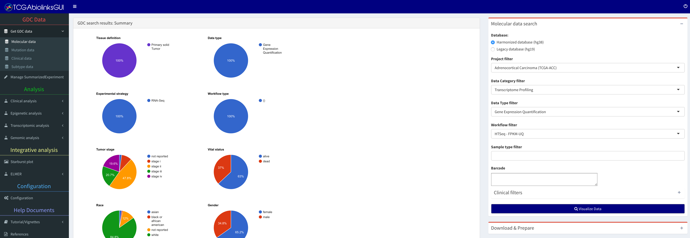

# Sub-menu: Molecular data

In this sub-menu the user can search, download and prepare GDC data.

## Advanced search box

Based on the following filters, it will show a table with the following results:

* Database
* Project filter
* Data category filter
* Data type filter
* Workflow filter
* Sample type filter
* List of barcodes
* Clinical filter: gender, race, vital status, tumor stage

## Download & Prepare box

After the search, the user can download the data and prepare it into an R object.
The data can be prepared into one of two formats:

* [Summarized Experiment](http://www.nature.com/nmeth/journal/v12/n2/abs/nmeth.3252.html) 
[@ref3]
* Data Frame

If the Summarized Experiment object is selected, then the subtype and clinical information will be added.
The object will be saved with the same name as the file name field.

# Sub-menu: Subtype data

The Cancer Genome Atlas (TCGA) Research Network has reported integrated genome-wide 
studies of various diseases. We have added some of the subtypes defined by these
reports in our package. The BRCA [@ref11], COAD [@ref12], GBM [@ref8], HNSC [@ref14], KICH [@ref15], KIRC[@ref21], KIRP [@ref20], LGG [@ref8], LUAD [@ref9], LUSC[@ref16], PRAD[@ref19], READ [@ref12],  SKCM [@ref13], STAD [@ref10], THCA [@ref18], UCEC [@ref17]. In subsequent versions, we will update this list.

The user can visualize the table with the information and save it as csv or R object (rda) file.

# Sub-menu: Clinical data

")

**Tutorial Video:** Fetching GDC clinical data - (http://www.youtube.com/watch?v=54NBug9ycwM)

# Sub-menu: Mutation data

In order to download the Mutation Annotation Format (MAF), we provide the user
with an interface to the `GDCquery_maf` function. Briefly, it will download the open acess maf files from
[https://gdc-docs.nci.nih.gov/Data/Release_Notes/Data_Release_Notes/](https://gdc-docs.nci.nih.gov/Data/Release_Notes/Data_Release_Notes/).
Four separate variant calling pipelines are implemented for GDC data harmonization which are described [here](https://gdc-docs.nci.nih.gov/Data/Bioinformatics_Pipelines/DNA_Seq_Variant_Calling_Pipeline/).

## Mutatation data search box

The available filters are:

* Tumor filter: a TCGA tumor, such as Breast invasive Carcinoma (TCGA-BRCA)
* Variant calling pipelines: Four separate variant calling pipelines are implemented for GDC data harmonization. Options: muse, varscan2, somaticsniper, mutect. 
