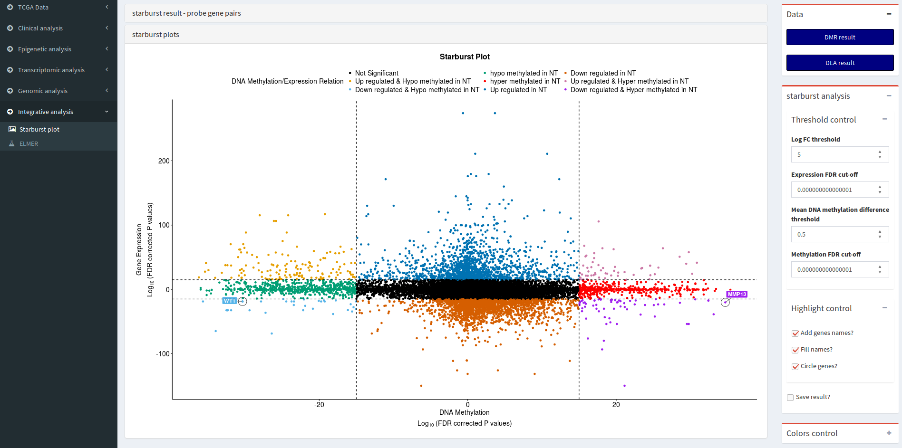
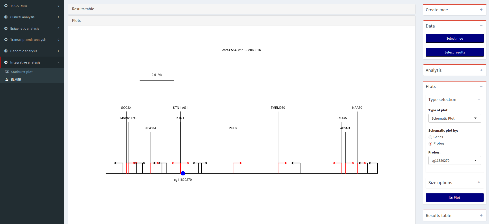

# Detailed explanation

For a detailed manual for this section please access these links:

1. [Starburst menu manual](https://drive.google.com/open?id=0B0-8N2fjttG-RzU1T1VQU2dQcXM)
2. [ELMER menu manual](https://drive.google.com/open?id=0B0-8N2fjttG-TDg1czNPUGUwTG8)

# Menu: Starburst plot

## Data 
Expected input is a csv file with the following pattern:

* DEA result: DEA_results_Group_subgruop1_subgroup2_pcut_0.01_logFC.cut_2.csv
* DMR result: DMR_results_Group_subgruop1_subgroup2_pcut_1e-30_meancut_0.55.csv

## Thresholds control

The possible thresholds controls are:

* Log FC threshold: gene expression Log2FC threshold
* Expression FDR cut-off: gene expression  FDR cut-off (y-axis)
* Mean DNA methylation difference threshold: Mean DNA methylation difference threshold
* Methylation FDR cut-off: DNA methylation FDR cut-off (x-axis)

The options Mean DNA methylation difference threshold and Log FC threshold are used to circle genes which pass the cut-offs previously defined (eg. mean methylation or FDR).

## Highlight control
The possible highlight controls are:

* Show gene names: show names of significant genes
* Boxed names: show names inside a box
* Circle genes: Circle candidate biologically significant genes

## Other option

* Save result: save results in a csv file

## Tutorial video:

 ")

**Tutorial Video:** Integrating DMR analysis and DEA results to be visualized into a starburst plot - (http://www.youtube.com/watch?v=_ec6Sij4MBc)

# Menu: ELMER (Enhancer Linking by Methylation/Expression Relationship)

This sub-menu will help the user to perform an integrative analysis between DNA methylation and Gene expression using the R/Bioconductor ELMER package [@yao2015inferring].

## Introduction

Recently, many studies suggest that enhancers play a major role as
regulators of cell-specific phenotypes leading to alteration in
transcriptomes realated to diseases
[@giorgio2015large; @groschel2014single; @sur2012mice; @yao2015demystifying].
In order to investigate regulatory enhancers that can be located at long
distances upstream or downstream of target genes Bioconductor offer the
[Enhancer Linking by Methylation/Expression Relationship
(ELMER)](http://bioconductor.org/packages/ELMER/) package. This package
is designed to combine DNA methylation and gene expression data from
human tissues to infer multi-level cis-regulatory networks. It uses DNA
methylation to identify enhancers and correlates their state with
expression of nearby genes to identify one or more transcriptional
targets. Transcription factor (TF) binding site analysis of enhancers is
coupled with expression analysis of all TFs to infer upstream
regulators. This package can be easily applied to TCGA public available
cancer data sets and custom DNA methylation and gene expression data
sets [@yao2015inferring].

[ELMER](http://bioconductor.org/packages/ELMER/) analysis have 5 main
steps:

1.  Identify distal enhancer probes on HM450K.

2.  Identify distal enhancer probes with significantly different DNA
    methyaltion level in control group and experiment group.

3.  Identify putative target genes for differentially methylated distal
    enhancer probes.

4.  Identify enriched motifs for the distal enhancer probes which are
    significantly differentially methylated and linked to putative
    target gene.

5.  Identify regulatory TFs whose expression associate with DNA
    methylation at motifs.

## Sub-menu ELMER: analysis

## Data: Create mee 

The [ELMER](http://bioconductor.org/packages/ELMER/) input is a
mee object that contains a DNA methylation matrix, an gene expression
matrix, a probe information GRanges, the gene information GRanges and a
data frame summarizing the data. It should be highlighted that samples
without both the gene expression and DNA methylation data will be
removed from the mee object.

By default the function *fetch.mee* that is used to create the mee
object will separate the samples into two groups, the control group
(normal samples) and the experiment group (tumor samples), but the user
can relabel the samples to compare different groups. 

The following steps are required:

* Select DNA methylation object: select a summarized Experiment object with the DNA methylation data
* Select expression object: select a summarized Experiment object with the gene expression data
* Select group column: Select the columns with the groups. This column will be selected from the Summarized Experiment object.
* Select Experiment group: Select the columns with the subgroup 1 (experiment)
* Select Control group: Select the columns with the subgroup 2 (control)
* Select DNA methylation: Cut-off NA samples (%): By default, for the DNA methylation data will remove probes with NA values in more than 20% samples and remove the annotation data.

Also, for RNA expression data it will
take the log2(expression + 1) of the expression matrix in order to
linearize the relation between DNA methylation and expression.

### Data: Select mee
 Select the R object (rda) file with a mee object created in the previous step.

### Analysis parameters

After preparing the data into a mee object, we will execute the five
[ELMER](http://bioconductor.org/packages/ELMER/) steps for both the hypo
(distal enhancer probes hypomethylated in the experiment group) and hyper
(distal enhancer probes hypermethylated in the experiment group) direction.

This box has all the available options for ELMER functions. Please see the [ELMER vignette](http://bioconductor.org/packages/release/bioc/vignettes/ELMER/inst/doc/vignettes.pdf). 

Also, a description of the data used by ELMER (such as the distal enhacer probes) is found in the
[ELMER.data](https://bioconductor.org/packages/release/data/experiment/vignettes/ELMER.data/inst/doc/vignettes.pdf)
vignette.

ELMER Identifies the enriched motifs for the distal enhancer probes
which are significantly differentially methylated and linked to putative
target gene, it will plot the Odds Ratio (x axis) for the each motifs
found.
These motifs by default have a minimum incidence of 10 probes 
(that means at least 10 probes were associated with the motif)
in the given probes set and the smallest lower boundary of 95%
confidence interval for Odds Ratio of 1.1.

After finding the enriched motifs,
[ELMER](http://bioconductor.org/packages/ELMER/) identifies regulatory
transcription factors (TFs) whose expression is associated with DNA
methylation at motifs. [ELMER](http://bioconductor.org/packages/ELMER/)
automatically creates a TF ranking plot for each enriched motif. This
plot shows the TF ranking plots based on the association score
$(-log(P value))$ between TF expression and DNA methylation of the
motif. We can see in Figure below that the top three TFs that are
associated with a motif found.

In case, it identifies regulatory transcription factors (TFs), a object with the prefix ELMER_results will be created
with the necessary data to visualize the results.

## Sub-menu ELMER: Visualize results

### Data

Select the R object (rda) file with ELMER results created in the analysis step (the one with prefix ELMER_results )

### Plot

Select ELMER plot. To access the plots, both the results and mee object must be selected. Please see  [ELMER vignette](http://bioconductor.org/packages/release/bioc/vignettes/ELMER/inst/doc/vignettes.pdf) for more details. 

### Results table
Select the ELMER results from the table. A results object should be selected.
