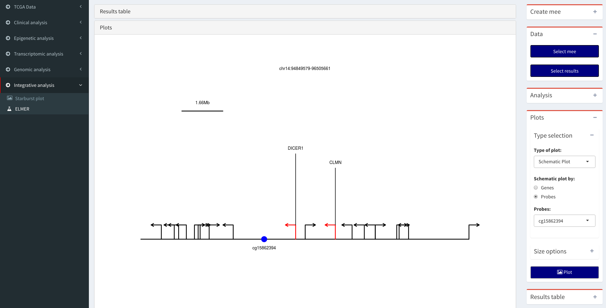

# Menu: Starburst plot

## Data 
Expected input is a csv file with the following pattern:

* DEA result: DEA_results_Group_subgruop1_subgroup2_pcut_0.01_logFC.cut_2.csv
* DMR result: DMR_results_Group_subgruop1_subgroup2_pcut_1e-30_meancut_0.55.csv

## Thresholds control

The possible thresholds controls are:

* Log FC threshold: gene expression Log2FC threshold
* Expression FDR cut-off: gene expression  FDR cut-off (y-axis)
* Mean DNA methylation difference threshold: Mean DNA methylation difference threshold
* Methylation FDR cut-off: DNA methylation FDR cut-off (x-axis)

The options Mean DNA methylation difference threshold and Log FC threshold are used to circle genes which pass the cut-offs previously defined (eg. mean methylation or FDR).

## Highlight control
The possible highlight controls are:

* Show gene names: show names of significant genes
* Boxed names: show names inside a box
* Circle genes: Circle candidate biologically significant genes

## Other option

* Save result: save results in a csv file

## Video:

 ")

**Tutorial Video:** Integrating DMR analysis and DEA results to be visualized into a starburst plot - (http://www.youtube.com/watch?v=_ec6Sij4MBc)

# Menu: ELMER
This sub-menu will help the user to perform an integrative analysis between DNA methylation and Gene expression using the R/Bioconductor ELMER package [@ref4].

## Sub-menu ELMER: analysis
### Data: Create mee 

ELMER works with a mee object, that has matched DNA methylation and gene expression data and divides the samples into two groups: experiment and control.

* Select DNA methylation object: select a summarized Experiment object with the DNA methylation data
* Select expression object: select a summarized Experiment object with the gene expression data
* Group column: Select the columns with the groups. This column will be selected from the Summarized Experiment object.
* Experiment group: Select the columns with the subgroup 1 (experiment)
* Control group: Select the columns with the subgroup 2 (control)

* DNA methylation: Cut-off NA samples (%): By default, for the DNA methylation data will remove probes with NA values in more than 20% samples and remove the annotation data.

### Data: Select mee
 Select the R object (rda) file with a mee object created in the previous step.

### Analysis

This box has all the available options for ELMER functions. Please see the ELMER vignette. 

## Sub-menu ELMER: Visualize results
### DATA

Select the R object (rda) file with ELMER results created in the analysis step.

### Plot
Select ELMER plot. To access the plots, both the results and mee object must be selected. Please see ELMER vignette for more details. 

### Results table
Select the ELMER results from the table. A results object should be selected.

