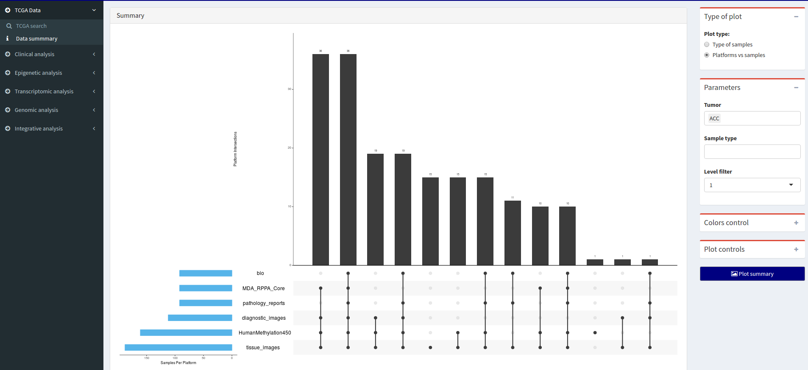
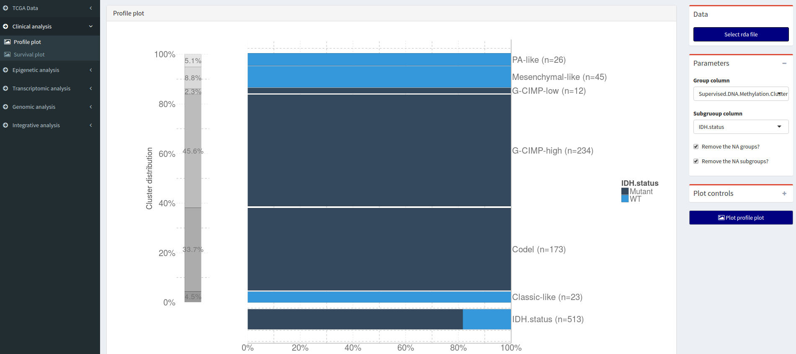
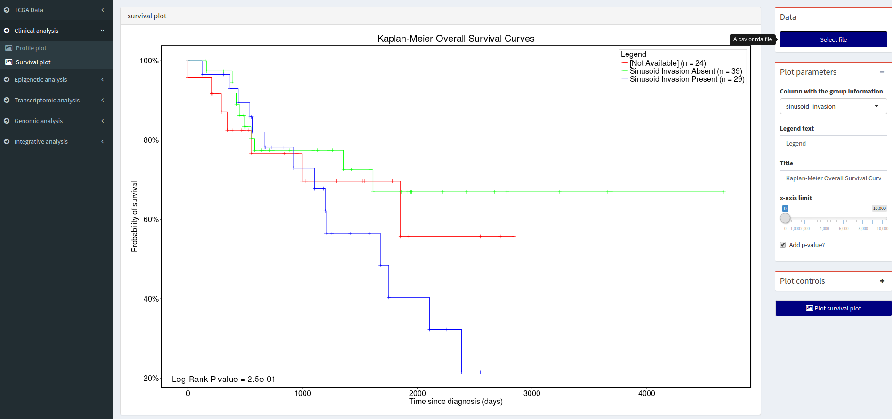
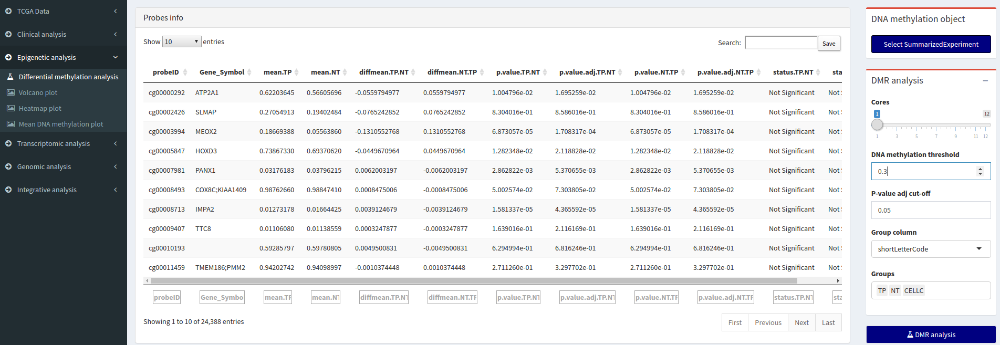
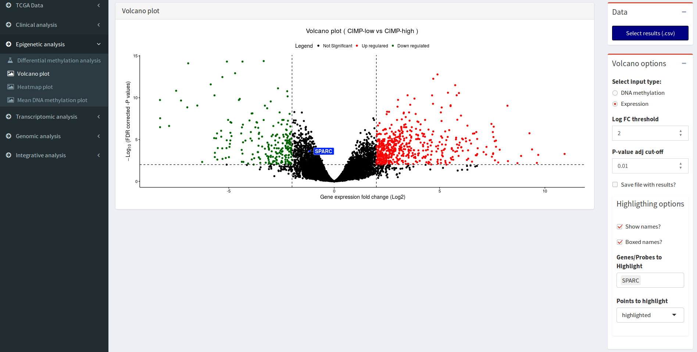
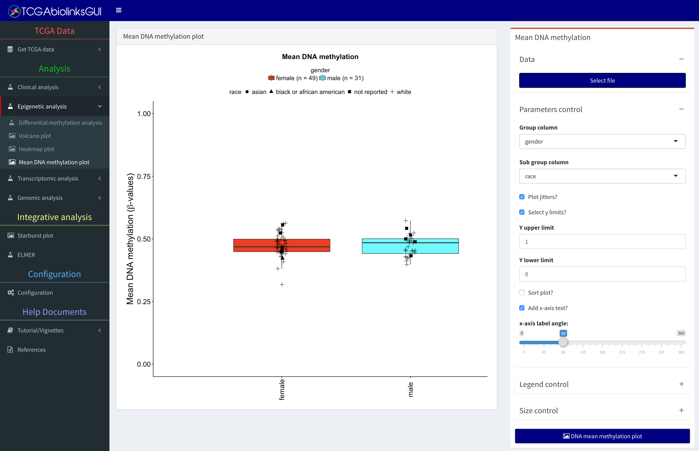
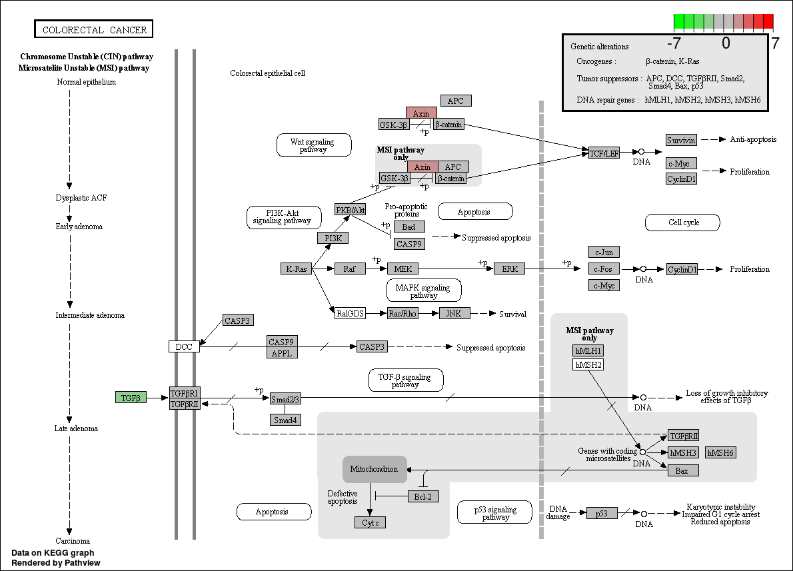
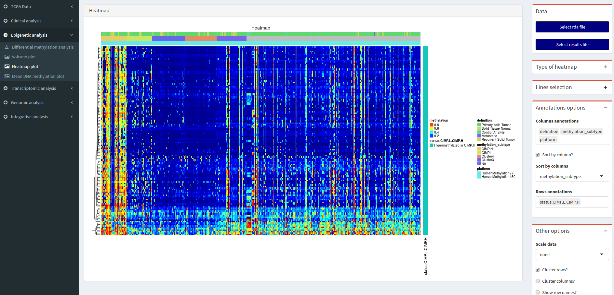
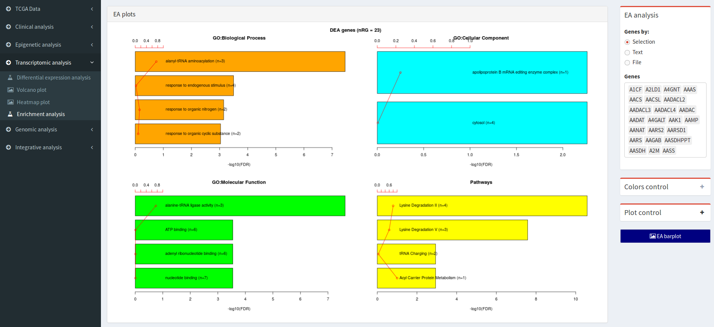
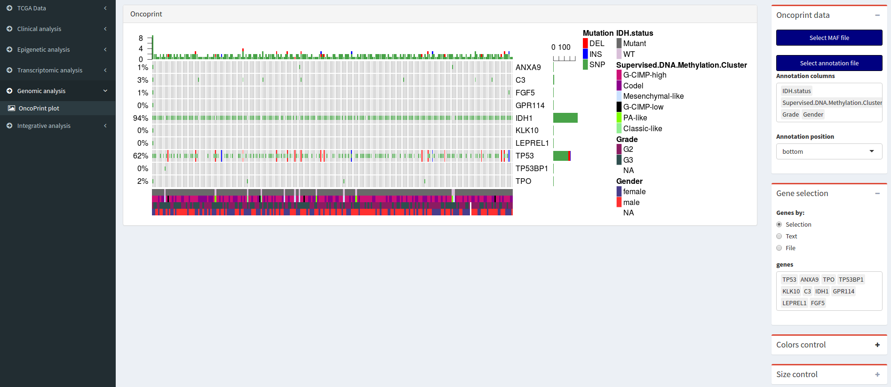

```{r setup, include=FALSE}
knitr::opts_chunk$set(dpi = 600)
knitr::opts_chunk$set(cache=TRUE)
```

```{r, echo = FALSE,hide=TRUE, message=FALSE,warning=FALSE}
devtools::load_all(".")
```

\newpage
# Introduction

TCGAbiolinksGUI was created to help users without knowledge of programming to search, download and analyze 
TCGA data. This package offers an graphical user interface to the R/biocondcutor packages [TCGAbiolinks]( 	http://bioconductor.org/packages/TCGAbiolinks/) [@ref2] and [ELMER](http://bioconductor.org/packages/ELMER/) packages [@ref4].
Also, some other useful packages from bioconductor, such as [ComplexHeatmap](http://bioconductor.org/packages/ComplexHeatmap/)  package [@ref1] has been used for data visualization.

In order to present the package we divided this vignette based in the GUI menus that
were created based on different group of analysis. The menus and sub-menus are:

* TCGA Data
    + TCGA search
    + Data summary
* Clinical analysis
    + Profile plot
    + Survival plot
* Epigenetic analysis
    + Differential methylation analysis
    + Volcano plot
    + Heatmap plot
    + Mean DNA methylation plot
* Transcriptomic analysis
    + Differential expression analysis
    + Volcano plot
    + Heatmap plot
    + Enrichement analysis
* Genomic analysis
    + Oncoprint Plot
* Integrative analysis
    + Starburst plot
    + ELMER

After the presentation of each menu, we dedicated a section to show how to execute some of the cases of studies showed in [TCGAbiolinks paper](http://doi.org/10.1093/nar/gkv1507) and [vignette](https://www.bioconductor.org/packages/devel/bioc/vignettes/TCGAbiolinks/inst/doc/tcgaBiolinks.html) but using only the TCGAbiolinksGUI.

\newpage
## Installation TCGAbiolinksGUI

To install the package from biocondcutor repository, please, use the code below.

```{r, eval = FALSE}
source("https://bioconductor.org/biocLite.R")
biocLite("TCGAbiolinksGUI")
```

To install the package from a binary package, please, use the code below.

```{r, eval = FALSE}
# dependencies
devtools::install_github("BioinformaticsFMRP/TCGAbiolinks")
source("https://bioconductor.org/biocLite.R")
biocLite(c("pathview","clusterProfiler"))
install.packages(c("UpSetR","shiny","ReporteRs"))
devtools::install_github("thomasp85/shinyFiles")
devtools::install_github("ebailey78/shinyBS", ref="shinyBS3")
devtools::install_github("daattali/shinyjs")
install.packages("~/TCGAbiolinksGUI_0.99.0_R_x86_64-pc-linux-gnu.tar.gz", repos = NULL, type = "source")
```

## Quick start

The following commands should be used in order to start the graphical user interface.

```{r, eval = FALSE}
library(TCGAbiolinksGUI)
TCGAbiolinksGUI()
```

## Citation

Please cite both TCGAbiolinks package and TCGAbiolinksGUI: 

* Colaprico A, Silva TC, Olsen C, Garofano L, Cava C, Garolini D, Sabedot T, Malta TM, Pagnotta SM, Castiglioni I, Ceccarelli M, Bontempi G and Noushmehr H. "TCGAbiolinks: an R/Bioconductor package for integrative analysis of TCGA data." Nucleic acids research (2015): gkv1507.

Also, if you have used ELMER analysis please cite:

*  Yao, L., Shen, H., Laird, P. W., Farnham, P. J., & Berman, B. P. "Inferring regulatory element landscapes and transcription factor networks from cancer methylomes." Genome Biol 16 (2015): 105.
* Yao, Lijing, Benjamin P. Berman, and Peggy J. Farnham. "Demystifying the secret mission of enhancers: linking distal regulatory elements to target genes." Critical reviews in biochemistry and molecular biology 50.6 (2015): 550-573.

\newpage
# Menu: TCGA Data

## Sub-menu: TCGA search

In this sub-menu the user can search, download and prepare TCGA data.


### Advanced seach box

Based on the following filters, it will show a table with results:

* Tumor filer
* PLatform filer
* Level filer

### Download box

After the search, the user can download the data. The user can select the lines that will be downloaded, if no lines are 
select, all lines will be downloaded.

To filter the data that will be downloaded the following options are given:

* No filter
* Samples type filter: Select the types to download. By defaults download all types (Primart solid tumor, recurrent solid tumor, etc)
* Samples barcode: Filters the samples based on a list of barcodes given by the user.

For some platforms, there are filter for file types:

* RNASeqV2: 
    + junction_quantification
    + rsem.genes.results
    + rsem.isoforms.results
    + rsem.genes.normalized_results
    + rsem.isoforms.normalized_results
    + bt.exon_quantification
* RNASeq: 
    + exon.quantification
    + spljxn.quantification
    + gene.quantification
* genome_wide_snp_6: 
    + hg18.seg
    + hg19.seg
    + nocnv_hg18.seg
    + nocnv_hg19.seg
* IlluminaHiSeq_miRNASeq: 
    + hg19.mirbase20.mirna.quantification
    + hg19.mirbase20.isoform.quantification
    + mirna.quantification
    + isoform.quantification

### Prepare box

This step used the information from Advanced search box and download box to prepare the data.

The data can be prepared into:

* [Summarized Experiment](http://www.nature.com/nmeth/journal/v12/n2/abs/nmeth.3252.html) 
[@ref3]
* Data Frame

For the Summarized Experiment object information subytpe can be added if the checkbox is selected (see next subsection).

### Subtype search box

The Cancer Genome Atlas (TCGA) Research Network has reported integrated genome-wide 
studies of various diseases. We have added some of the subtypes defined by these
reports in our package. The BRCA [@ref11], COAD [@ref12], GBM [@ref8], HNSC [@ref14], KICH [@ref15], KIRC[@ref21], KIRP [@ref20], LGG [@ref8], LUAD [@ref9], 
LUSC[@ref16], PRAD[@ref19], READ [@ref12],  SKCM [@ref13], STAD [@ref10], THCA [@ref18], UCEC [@ref17] tumors have data added. 

The user can visualize the table with the information and save it as csv or rda file.

### MAF search box
In order to download the Mutation Annotation Format (MAF), it will get the tables from [TCGA MAF](https://wiki.nci.nih.gov/display/TCGA/TCGA+MAF+Files), remove the obsolete/protected
files. The user can select from the table which MAF file to download. The output will be a rda file.

### Directory to save and prepare files

Use this to select where the data should be downloaded and prepared in the computer.


## Sub-menu: Data summary

In this sub-menu the user can view a summary of the TCGA data.





### Type of plot

* Type of samples: Creates a barplot for each tumor vs platform showing the type of samples in each. This is useful, for example, to know if we have normal or recurrent samples.
* Platform vs samples: Creates a  UpSet Plot for a tumor type. This will show how many samples do we have for each platform,
and how many samples have data for different platforms. For example, in the figure before it shows that
102 patients have samples only for Genome_Wide_SNP_6 platform (first vertical bar) while 45 patients have samples for all the five platforms (second vertical bar).

### Parameters

* Tumor: Tumor selection. For the plot "Type of samples" more than one can be selected, while for "Platform vs samples"
only one can be selected.
* Platforms: Platform selection. For the plot "Type of samples" more than one can be selected.
* Level fiter: Level of data selection.Only one can be selected.
* Sample type: Filter samples by types. Only used in "Platform vs samples" plot.

### Colors control
Change the color of the plot

### Plot control
Change the size of the plot

\newpage
# Menu: Clinical analysis

## Sub-menu: Profile plot
Sometimes we would like to see the distribution of some features in each cluster. 
We could do a barplot for each cluster in which the bars would have the counts of the subtypes.

But here, we propose another way to display the association between cancer subtypes and any kind of clustering is using the TCGAvisualize_profilePlot function.

The profilePlot will have tree important regions, the distribuition in percentage of a feature inside the cluster (central bars), the distribution of the samples over the clusters (left bar), and the subytype distribution taking in cosideration all samples (bottom bar).

For example in the plot below our groups are the DNA methylation cluster (Codel, Classic-like, G-CIMP-high, G-CIMP-low, mesenchymal-like,PA-like), the subgroup is the IDH status (Mutant or WT - wild Type). From the bottom bar
we can easily see that the majority of samples are Mutant. From the left bar we can easily see that codel and 
G-cimp-high are the bigger groups. And from the central plot we can see that mesenchymal-like, PA-like and classic-like 
are all WT. As the distribution of this subgroup in not equal in the groups, this means that the division of the group
has some relation with the subgroup informatio. So IDH status might be defining the group distribution.



### Data box
A cvs or rda file with the subtype information.

### Plot parameters

* Group column: select the column that defines the groups
* Subgroup column: select the column that defines the subpgroups
* Remove NA groups: if any of the groups is NA it will be removed
* Remove NA subgroups: if any of the subgroups is NA it will be removed

### Plot control

Change the size of the plot and the margins that will control the position of the left bar if not very well aligned.

## Sub-menu: Survival plot
From the clinical data download in the TCGA data menu, the user can use it to verify the survival of groups.



### Data box
A cvs or rda file with the clinical information.

### Parameters box

* Group column: Select the column that identifies the group of each sample.
* Legend text: Text of the legend.
* Title: Title text.
* x-axis limit: Limits the x-axis, if 0 no cut-off is considered.
* Add p-value: Add p-value to the plot.

### Plot control
Change the size of the plot

\newpage
# Menu: Epigenetic analysis

## Sub-menu: Differential methylation analysis

The user will be able to perform a Differential methylation Regions (DMR) analysis.
The output will be a file with the folowing pattern: DMR_results_GroupCol_group1_group2_pcut_1e-30_meancut_0.55.csv
Also, the summarized Experiment will be saved with all the results inside it, the new object will be saved with _result suffix.

Obs: Depending on the number of samples and the number of probes, this analysis can go from minutes to days.



### DNA methylation object box

Select a summarized Experiment object (rda)

### DNA analysis box

* Cores: Selects the number of cores to be used in the analysis
* DNA methylation threshold: minimun difference of DNA methylation levels to be considered as hyper/hypomethylated
* P-value adj cut-off: minimun adjusted P-value to be considered as siginificant.
* Group column: columns with the groups to be used in the analysis
* Groups: Select at least two groups to the analyis. For example if it has three groups (g1,g2 and g3) the analysis will
output g1 vs g2, g1 vs g3 and g2 vs g3.


## Sub-menu: Volcano plot

In this sub-menu the user will be able to plot the results from Differentially methylated regions (DMR) 
analysis and differential expression analysis (DEA). 



### Data box
Expected input a csv file with the following pattern:

* For expression: DEA_results_Group_subgruop1_subgroup2_pcut_0.01_logFC.cut_2.csv
* For DNA methylation: DMR_results_Group_subgruop1_subgroup2_pcut_1e-30_meancut_0.55.csv

### Volcano box
This box will control the x-axis thresholds "Log FC threshold" for expression and "DNA methylation threshold" for DNA methylation and the y-axis thresholds "P-value adj cut-off".

Checkbox option:

* Show names: Show the names of up/down regulated genes or hypo/hyper methylated probes 
* Boxed names: put names inside a box.
* Save file with results: Create a file with the same pattern as the one in the input, but with the 
new thersholds.

There is a possibility to highlight some specific genes/probes using the "Highlightining option" suboptions.

The option "points to highlight" has the possibilities:

* highlighted - show the names for only the highlighted genes/probes list
* sinigifcant - show the names for only the up/down regulated genes or hypo/hyper methylated probes 
* both - show both gtoups

### Color control
Change the color of the plot

### Plot control
Change the size of the plot

## Sub-menu: Mean DNA methylation plot

In this sub-menu the user will be able to plot the mean DNA methylation by groups.



### DNA methylation object box
Expected input a rda file with a summarized Experiment object.

### Mean DNA methylation box

* Groups column: Select the column that will split the data into groups. 
This column is selected from the  sample matrix (accessed with colData)

* Subgroups column: Select the column that will highlight the different subgroups data in the groups. 
* Plot jitters: Show jitters
* Sort method: Methods to sort the groups in the plot
* x-axis label angle: Change angle of the text in the x-axis

### Plot control
Change the size of the plot

\newpage
# Menu: Transcriptomic analysis
In this sub-menu the user will be able to perform an enrichemnt analysis and see
the biological process, cellular component, molecular function and pathways in which the genes 
select have a role.

## Sub-menu: Differential expression analysis

### Gene expression object box

Select a summarized Experiment object (rda)

### Normalization of genes

* Normalization of genes? Normalize the genes?
* Normalization of genes method? Options: gcContent, geneLength

### Quantile filter of genes

* Quantile filter of genes?
* DEA test method: quantile, varFilter, filter1, filter2
* Threshold selected as mean for filtering

### DEA analysis

* Log FC threshold: Log2FoldChange  threshold
* P-value adj cut-off: significant threshold
* Group column: group column in the summarized Experiment object
* Group 1: Group 1 for comparison
* Group 2: Group 2 for comparison
* DEA test method: options glmRT, exactTest

### Pathway graphs

* DEA result: Select csv file create by the analysis.
* Pathway ID: plot results in a pathway graphs. See bioconductor [pathview](http://bioconductor.org/packages/pathview/) [@ref5] package.




## Sub-menu: Heatmap plot



### Lines selection

* By status: Based on the results file the user can select to see hyper/hypo methylated probes
* Text: the user can write a list of genes separeted by ";" , "," or a new line

### Annotation options

* Columns annotation: using the data in the summarized experiment the user can annotate the heatmap.
* Sort by column: The order of the columns can be sorted by one of the selected columns
* Row annotation: Add annotation to rows


### Other options

* Scale data: option "none", "by row","column"
* Cluster rows ?
* Cluster columns ?
* Show row names ?
* Show col names ?

### Plot control
Change the size of the plot and the number of bars to plot

## Sub-menu: Enrichment analysis

Researchers, in order to better understand the underlying biological processes, often want to retrieve a functional profile of a set of genes that might have an important role. This can be done by performing an enrichment analysis.

Given a set of genes that are up-regulated under certain conditions, an enrichment analysis will identify classes of genes or proteins that are over-represented using annotations for that gene set.




### EA analysis
Input a list of genes by:

* Selection: The user can select by hand multiple genes from a list
* Text: the user can write a list of genes separeted by ";" , "," or a new line
* File: select a file (rda, csv, txt) with a column Gene_symbol or mRNA

### Colors control
Change the color of the plot

### Plot control
Change the size of the plot and the number of bars to plot

\newpage
# Menu: Genomic analysis

## Sub-menu: Oncoprint

Using oncoPrint function from the [ComplexHeatmap](http://bioconductor.org/packages/ComplexHeatmap/) package,
this sub-menu offer a way to visualize multiple genomic alteration.




### Oncoprint data box

* Select MAF file: Select a MAF file (.rda) with mutatation annotation information
* Select annotation file: Select a rda rda with the metadata information. Columns "patient" or "bcr_patient_barcode"
should exist.
* Annotation columns: Which columns of the annotation file should be showed?
* Annotation position: where the annotation should be added? Top or bottom.


### Gene selection

* Selection: The user can select by hand multiple genes from a list
* Text: the user can write a list of genes separeted by ";" , "," or a new line
* File: select a file (rda, csv, txt) with a column Gene_symbol or mRNA

### Colors control
Change the color of the plot

### Plot control
Change the size of the plot

### Oncoprint options

* Remove empty columns? If a samples has no mutation it will be removed from the plot 
* Show column names? Show patient barcodes
* Show barplot annotation on rows? Show right barplot?

\newpage
# Menu: Integrative analysis

## Sub-menu: Starburst plot


### Data box
Expected input a csv file with the following pattern:

* DEA result: DEA_results_Group_subgruop1_subgroup2_pcut_0.01_logFC.cut_2.csv
* DMR result: DMR_results_Group_subgruop1_subgroup2_pcut_1e-30_meancut_0.55.csv

### Starburst analysis

The possible thresholds controls are:

* Log FC threshold: gene expression Log2FC threshold
* Expression FDR cut-off: gene expression  FDR cut-off (y-axis)
* Mean DNA methylation difference threshold: Mean DNA methylation difference threshold
* Methylation FDR cut-off: DNA methylation FDR cut-off (x-axis)


The options  Mean DNA methylation difference threshold and Log FC threshold
are used to circle relevant genes (genes that respect these thresholds)

The possible highlight controls are:

* Show genes names: show names of significant genes
* Boxed names: show names inside a box
* Circle gnees: Circle candidate biologically significant genes

Other option

* Save result: save results in a csv file

### Colors control
Change the color of the plot

### Plot control
Change the size of the plot

## Sub-menu: ELMER
This sub-menu will help the user to perform the analysis from R/bioconductor ELMER package [@ref4].


### Create mee box

ELMER works with a mee object, that has matched DNA methylation and gene expression data and
divides the samples into two groups experiment and control.

* Select DNA methylation object: select a summarized Experiment object with the DNA methylation data
* Select expression object: select a summarized Experiment object with the gene expression data
* Group column: Select the columns with the groups. This column will be selected from the Summarized Experiment object.
* Experiment group: Select the columns with the subgroup 1 (experiment)
* Control group: Select the columns with the subgroup 2 (control)

* DNA methylation: Cut-off NA samples (%): By default, for the DNA methylation data 
will remove probes with NA values in more than 20% samples and remove the 
anottation data.

### Data box

* Select mee: select an rda file with a mee object
* Select results: select an rda file with the results from ELMER analysis.

### Analysis

This box has all the option for elmer functions. Please, see ELMER vignette. 

### Plot
Select ELMER plot. To have access to all plot it needs that the results and mee object
are selected. Please, see ELMER vignette. 

### Results table
Select which ELMER results in a table.  It needs that the results to be selected.

\newpage
# Cases of study 

## Case 3
[](http://www.youtube.com/watch?v=3W40ycOtDZY "Case study 3")

## Case 4
[](http://www.youtube.com/watch?v=Ki5UOcs-5mY "Case study 4")


\newpage
# Session info

```{r sessionInfo, results='asis', echo=FALSE}
toLatex(sessionInfo())
```
\newpage
# References
