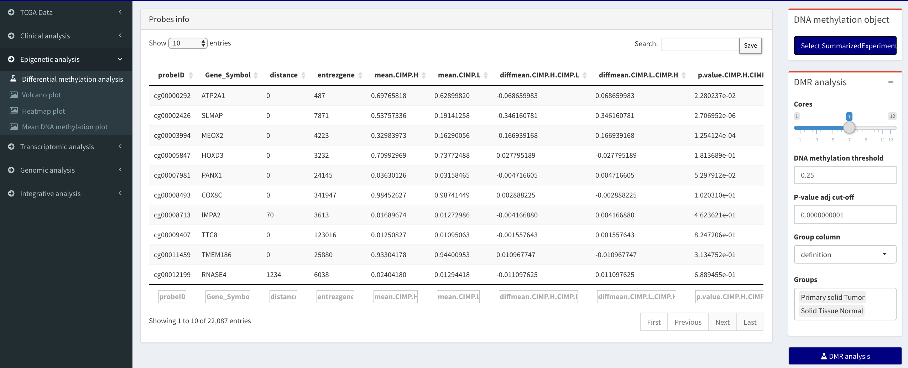
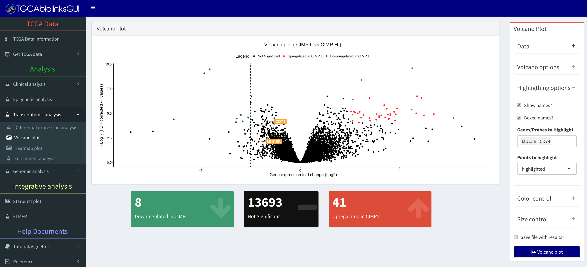
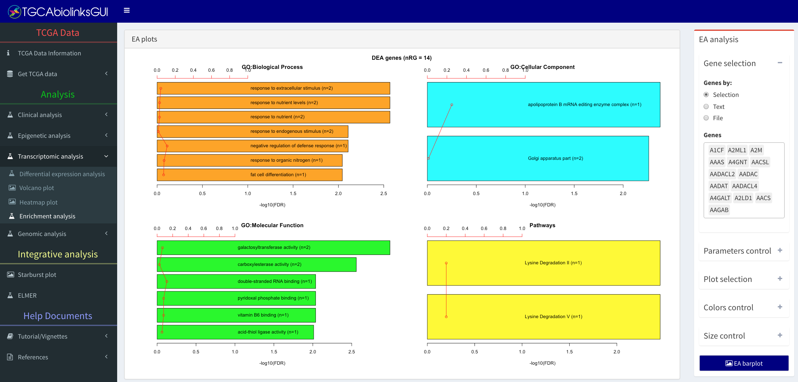

\newpage
# Introduction

TCGAbiolinksGUI was created to help users more comfortable with graphical user interfaces (GUI) to search, download and analyze Cancer data. 
It offers a graphical user interface to the R/Bioconductor package [TCGAbiolinks](http://bioconductor.org/packages/TCGAbiolinks/) [@TCGAbiolinks], which is able to access The National Cancer Institute (NCI) Genomic Data Commons (GDC) through its  
[GDC Application Programming Interface (API)](https://gdc.cancer.gov/developers/gdc-application-programming-interface-api).
Additional packages from Bioconductor are included, such as [ComplexHeatmap](http://bioconductor.org/packages/ComplexHeatmap/) package [@Gu20052016] to aid in visualizing the data, 
[ELMER](http://bioconductor.org/packages/ELMER/) [@yao2015inferring] to identify regulatory enhancers using gene expression + DNA methylation data + motif analysis and 
[Pathview](http://bioconductor.org/packages/pathview/) [@luo2013pathview] for pathway-based data integration and visualization.

The GUI was created using [Shiny](https://shiny.rstudio.com/), a Web Application Framework for R, and uses
several packages to provide advanced features that can enhance Shiny apps, such as [shinyjs](https://github.com/daattali/shinyjs) to add JavaScript actions for the app,
[shinydashboard](https://github.com/rstudio/shinydashboard) to add dashboards and [shinyFiles](https://github.com/thomasp85/shinyFiles) to provide an API for client side access to the server file system. 
A running version of the GUI is found in [shinyapps.io](https://tcgabiolinksgui.shinyapps.io/demo/)

This work has been supported by a grant from Henry Ford Hospital (H.N.) and by the São Paulo Research Foundation [FAPESP](http://www.fapesp.br/) (2016/01389-7 to T.C.S. & H.N. and 2015/07925-5 to H.N.) the BridgeIRIS project, funded by INNOVIRIS, Region de Bruxelles Capitale, Brussels, Belgium, and by GENomic profiling of Gastrointestinal Inflammatory-Sensitive CANcers (GENGISCAN), Belgian FNRS PDR (T100914F to A.C., C.O. & G.B.). T.C.S. and B.P.B. were supported by the NCI Informatics Technology for Cancer Research program, NIH/NCI grant 1U01CA184826.


# Starting with TCGAbiolinksGUI 

## Installation 

To install the package from the [Bioconductor repository](http://bioconductor.org/packages/TCGAbiolinksGUI/) please use the following
code. 

```{r, eval = FALSE}
source("https://bioconductor.org/biocLite.R")
biocLite("TCGAbiolinksGUI", dependencies = TRUE)
```

To install the development version of the package via GitHub:

```{r, eval = FALSE}
source("https://bioconductor.org/biocLite.R")
deps <- c("pathview","clusterProfiler","ELMER", "DO.db","GO.db",
          "ComplexHeatmap","EDASeq", "TCGAbiolinks")
for(pkg in deps)  
    if (!pkg %in% installed.packages()) biocLite(pkg, dependencies = TRUE)
deps <- c("devtools","shape","shiny","readr","googleVis",
          "shinydashboard","shinyFiles","shinyjs","shinyBS")
for(pkg in deps)  
    if (!pkg %in% installed.packages())  install.packages(pkg,dependencies = TRUE)
devtools::install_github("BioinformaticsFMRP/TCGAbiolinksGUI")
```


## Quick start

The following commands should be used to start the graphical user interface.

```{r, eval = TRUE, include=FALSE}
library(TCGAbiolinks)
library(knitr)
library(dplyr)
library(SummarizedExperiment)
```

```{r, eval = FALSE}
library(TCGAbiolinksGUI)
TCGAbiolinksGUI()
```

## Docker image

TCGAbiolinksGUI is available as Docker image (self-contained environments that contain everything needed to run the software), 
which can be easily run on Mac OS, Windows and Linux systems. 

The image can be obtained from Docker Hub: https://hub.docker.com/r/tiagochst/tcgabiolinksgui/

For more information please check: https://docs.docker.com/ and https://www.bioconductor.org/help/docker/

### Setting up image using graphical user interface (GUI) 

This [PDF](https://drive.google.com/open?id=0B0-8N2fjttG-QXp5LVlPQnVQejg) 
shows how to install and execute the image using [kitematic](https://kitematic.com/), which
offers a  graphical user interface (GUI) to control your app containers.

### Setting up image using command-line 

- Download image: docker pull tiagochst/tcgabiolinksgui
- To run RStudio Server and shiny-server, but the data is not saved if container is stopped: 
`sudo docker run -d -P -v /home/$USER/docker:/home/rstudio -p 3333:8787 -p 3334:3838 tiagochst/tcgabiolinksgui`
1. For more information how data can be saved please read [this wiki](https://github.com/rocker-org/rocker/wiki/How-to-save-data) and see command below 

- To run RStudio Server, shiny-server and save the results in the host machine please use the code below: 
`sudo docker run -d -P -v /home/$USER/docker:/home/rstudio -p 3333:8787 -p 3334:3838 tiagochst/tcgabiolinksgui`
 1. In case Rstudio is not accessible please check if the folder created (docker) has the right permission
 2. If your system is windows or macOS you will need to change  `/home/$USER/docker` 
 to the correct system path. Examples can be found at this [GitHub page](https://github.com/rocker-org/rocker/wiki/Sharing-files-with-host-machine)

### Accessin the tools after the image is running:

- TCGAbiolinksGUI will be available at <your local IP>:3334/tcgabiolinksgui
- RStudio will be available at <your local IP>:3333 (***username: rstudio*** , ***password:rstudio***)


## Online manual

An online version of the manual is available at [bioconductor website](https://bioconductor.org/packages/devel/bioc/vignettes/TCGAbiolinksGUI/inst/doc/index.html).

## Video tutorials

To facilitate the use of this package, we have created some tutorial videos demonstrating the tool.
Some sections have video tutorials that if clicked will redirect to the video on youtube.
For the complete list of videos, please check this [youtube list](https://www.youtube.com/playlist?list=PLoDzAKMJh15m40f7OqOLAW0nJwkVStJIJ).

## PDF tutorials

For each section we created some PDFs with detailing the steps of each section: 
[Link to folder with PDFs](https://drive.google.com/drive/folders/0B0-8N2fjttG-Q25ldVVmUTVOTk0?usp=sharing)

## Question and issues
Please use [Github issues](https://github.com/BioinformaticsFMRP/TCGAbiolinksGUI/issues) if you want to file bug reports or feature requests.

## Data input summary
```{r table2, echo=FALSE, message=FALSE, warnings=FALSE, results='asis'}
tabl <- "  
| Menu                    | Sub-menu                          | Button             | Data input  |
|---------------------------------|-----------------------------------|------------------------------------|-----------------------------------------------------------------------------------------------------------------------|
| Clinical analysis       | Profile Plot                      | Select file        | A table with at least two categorical columns  |
| Clinical analysis       | Survival Plot                     | Select file        | A table with at least the following columns: days_to_death, days_to_last_followup and one column with a group |
| Epigenetic analysis     | Differential methylation analysis | Select data (.rda) | A summarizedExperiment object |
| Epigenetic analysis     | Volcano Plot                      | Select results     | A csv file with the following pattern: DMR_results_GroupCol_group1_group2_pcut_1e-30_meancut_0.55.csv  (Where GroupCol, group1, group2 are the names of the columns selected in the  DMR steps. |
| Epigenetic analysis     | Heatmap plot                      | Select file        | A summarizedExperiment object  |
| Epigenetic analysis     | Heatmap plot                      | Select results     | Same as Epigenetic analysis >Volcano Plot > Select results |
| Epigenetic analysis     | Mean DNA methylation              | Select file        | A summarizedExperiment object |
| Transcriptomic Analysis | Volcano Plot                      | Select results     | A csv file with the following pattern: DEA_results_GroupCol_group1_group2_pcut_1e-30_meancut_0.55.csv (Where GroupCol, group1, group2 are the names of the columns selected in the DEA steps. |
| Transcriptomic Analysis | Heatmap plot                      | Select file        | A summarizedExperiment object  |
| Transcriptomic Analysis | OncoPrint plot                      | Select MAF file        | A MAF file (columns needed: Hugo_Symbol,Tumor_Sample_Barcode,Variant_Type) |   |
| Transcriptomic Analysis | OncoPrint plot                      | Select Annotation file        | A file with at least the following columns: bcr_patient_barcode  |    |
|  Integrative analysis   | Starburst plot                      | DMR result        | A csv file with the following pattern: DMR_results_GroupCol_group1_group2_pcut_1e-30_meancut_0.55.csv (Where GroupCol, group1, group2 are the names of the columns selected in the DMR steps.  |
|  Integrative analysis   | Starburst plot                      | DEA result        | A csv file with the following pattern: DEA_results_GroupCol_group1_group2_pcut_1e-30_meancut_0.55.csv (Where GroupCol, group1, group2 are the names of the columns selected in the DEA steps.  |
|  Integrative analysis   | ELMER                      | Create mee > Select DNA methylation object         | An rda file with a summarized Experiment object |   
|  Integrative analysis   | ELMER                      | Select results > Select expression object         |  An rda file with the RNAseq data frame |   
|  Integrative analysis   | ELMER                      | Select mee         | An rda file with a mee object |   
|  Integrative analysis   | ELMER                      | Select results         | An rda file with the results of the ELMER analysis |   
"
cat(tabl) 
```
## Citation

Please cite both TCGAbiolinks package and TCGAbiolinksGUI: 

* Silva TC, Colaprico A, Olsen C, Bontempi G, Ceccarelli M, Berman BP. , and Noushmehr H. "TCGAbiolinksGUI: A Graphical User Interface to analyze cancer molecular and clinical data."Bioinformatics -  Submitted for review.
* Colaprico A, Silva TC, Olsen C, Garofano L, Cava C, Garolini D, Sabedot T, Malta TM, Pagnotta SM, Castiglioni I, Ceccarelli M, Bontempi G and Noushmehr H. "TCGAbiolinks: an R/Bioconductor package for integrative analysis of TCGA data." Nucleic acids research (2015): gkv1507.

Other related publications to this package:

* "TCGA Workflow: Analyze cancer genomics and epigenomics data using Bioconductor packages". F1000Research [10.12688/f1000research.8923.1](http://dx.doi.org/doi:10.12688/f1000research.8923.1) [@10.12688/f1000research.8923.2]

If you used ELMER please cite:

* Yao, L., Shen, H., Laird, P. W., Farnham, P. J., & Berman, B. P. "Inferring regulatory element landscapes and transcription factor networks from cancer methylomes." Genome Biol 16 (2015): 105.
* Yao, Lijing, Benjamin P. Berman, and Peggy J. Farnham. "Demystifying the secret mission of enhancers: linking distal regulatory elements to target genes." Critical reviews in biochemistry and molecular biology 50.6 (2015): 550-573.

If you used OncoPrint plot and Heatmap Plot please cite:

* Gu, Zuguang, Roland Eils, and Matthias Schlesner. "Complex heatmaps reveal patterns and correlations in multidimensional genomic data." Bioinformatics (2016): btw313

If you used Pathway plot please cite:

* Luo, Weijun, Brouwer and Cory (2013). “Pathview: an R/Bioconductor package for pathway-based data integration and visualization.” Bioinformatics, 29(14), pp. 1830-1831.


\newpage
# GDC data menus
## Detailed explanation

For a detailed manual for this section please access this link:

1. [Data menu manual](https://drive.google.com/file/d/0B0-8N2fjttG-X1BoNlNnUnpVMWc/view?usp=sharing)
2. [Manage SummarizedExperiment](https://drive.google.com/file/d/0B0-8N2fjttG-TVVOcTNFRlh3YXM/view?usp=sharing)

## Menu: Get GDC data menu

### Sub-menu: Molecular data

In this sub-menu, the user will be able to search, download and prepare The NCI's Genomic Data Commons (GDC)  data for analysis.
The first step is to search for GDC open data access with the Advanced search box. The search results will be summarized in plots in the center of the screen. The second step is to download and prepare the data into an R object 
to be used in the analysis steps.


####  Useful information

<div class="panel panel-info">
<div class="panel-heading">Different sources: Legacy vs Harmonized</div>
<div class="panel-body">


There are two available sources to download GDC data using TCGAbiolinks:
- GDC Legacy Archive: provides access to an unmodified copy of data that was previously stored in
  [CGHub](https://cghub.ucsc.edu/) and in the TCGA Data Portal hosted by the TCGA Data Coordinating Center (DCC), in which uses
  as references GRCh37 (hg19) and GRCh36 (hg18).
- GDC harmonized database: data available was harmonized against GRCh38 (hg38) using GDC Bioinformatics Pipelines
  which provides methods to the standardization of biospecimen and
  clinical data.

</div>
</div>


<div class="panel panel-info">
<div class="panel-heading">Understanding the barcode</div>
<div class="panel-body">

A TCGA barcode is composed of a collection of identifiers. Each specifically identifies a TCGA data element. Refer to the following figure for an illustration of how metadata identifiers comprise a barcode. An aliquot barcode contains the highest number of identifiers.

Example: 

- Aliquot barcode: TCGA-G4-6317-02A-11D-2064-05
- Participant: TCGA-G4-6317
- Sample: TCGA-G4-6317-02

For more information check [TCGA wiki](https://wiki.nci.nih.gov/display/TCGA/TCGA+barcode)
</div>
</div>

#### Advanced search box


The following filters are available to select the data:

* Database
* Project filter
* Data category filter
* Data type filter
* Workflow filter
* Sample type filter
* Platform filter
* List of barcodes
* Clinical filter: gender, race, vital status, tumor stage.

<div class="panel panel-warning">
<div class="panel-heading">Repeated cases (barcodes) </div>
<div class="panel-body">

In the search step, it is important that there are no repeated 
cases, otherwise, the prepare step might not work. If it happens, the search will give you this warning "There are more than one file for the same case." 
To solve this problem, you  probably need to use more filters to correctly select your data. 

As an example of this problem, if you use only Project (i.e "TCGA-ACC") and Data category filter (i.e "Copy Number Variation"), for each sample we have two data types "Copy Number segment" and "Masked Copy Number segment". 

</div>
</div>


#### Download & Prepare box

After the search step, the user can download the data and prepare it into an R object.
The data can be prepared into one of two formats:

* [SummarizedExperiment](http://www.nature.com/nmeth/journal/v12/n2/abs/nmeth.3252.html) 
[@huber2015orchestrating]: An R object that contains the sample information matrix (clinical and subtype information),
the assay matrix (i.e DNA methylation beta-values), the features matrix (i.e information for each probe in the DNA methylation assay matrix).
* Data Frame: A simple table with only the assay matrix (i.e Gene expression quantification)

In case a SummarizedExperiment object was selected the user will be able to add more metadata information into the  sample information matrix. By checking "Add gistic2 and mutation information" and giving a list of genes,
the GUI will download GISTIC2 data from the GDAC Firehose and Mutation Annotation Files (MAF) and their information
to the object. This might be useful, for example, if the user wants to evaluate the survival of mutant samples vs non-mutant or if he wants to evaluate it on a heatmap, which can be used as labels.

Finally, the object will be saved with the same name as the file name field.

### Sub-menu: Subtype data

The Cancer Genome Atlas (TCGA) Research Network has reported integrated genome-wide 
studies of various diseases. We have added some of the subtypes defined by these
reports in our package.  

- [BRCA](https://www.ncbi.nlm.nih.gov/pmc/articles/PMC3465532/)[@cancer2012comprehensive_brca]
- [COAD](http://www.nature.com/nature/journal/v487/n7407/abs/nature11252.html) [@cancer2012comprehensive_colon] 
- [GBM](http://dx.doi.org/10.1016/j.cell.2015.12.028) [@Cell]
- [HNSC](http://www.nature.com/nature/journal/v517/n7536/abs/nature14129.html) [@cancer2015comprehensive]
- [KICH](http://www.sciencedirect.com/science/article/pii/S1535610814003043) [@davis2014somatic]
- [KIRC](http://www.nature.com/nature/journal/v499/n7456/abs/nature12222.html)[@cancer2013comprehensive] 
- [KIRP](http://www.nejm.org/doi/full/10.1056/NEJMoa1505917) [@cancer2016comprehensive] 
- [LGG](http://dx.doi.org/10.1016/j.cell.2015.12.028)[@Cell] 
- [LUAD](http://www.nature.com/nature/journal/v511/n7511/abs/nature13385.html) [@cancer2014comprehensive] 
- [LUSC](http://www.nature.com/nature/journal/v489/n7417/abs/nature11404.html)[@cancer2012comprehensive_lusc] 
- [PRAD](http://www.sciencedirect.com/science/article/pii/S0092867415013392)[@cancer2015molecular_prad] 
- [READ](http://www.nature.com/nature/journal/v487/n7407/abs/nature11252.html) [@cancer2012comprehensive] 
- [SKCM](http://www.sciencedirect.com/science/article/pii/S0092867415006340) [@cancer2015genomic_skcm] 
- [STAD](http://www.nature.com/nature/journal/v511/n7511/abs/nature13385.html) [@cancer2014comprehensive] 
- [THCA](http://www.sciencedirect.com/science/article/pii/S0092867414012380) [@cancer2014integrated] 
- [UCEC](http://www.nature.com/nature/journal/v497/n7447/abs/nature12113.html) [@cancer2013integrated]

The user can visualize the table with the information and save it as csv or R object (rda) file.

### Sub-menu: Clinical data

TCGAbiolinks has provided a few functions to search, download and parse GDC clinical data. 

#### Useful information


<div class="panel panel-info">
<div class="panel-heading">Different sources</div>
<div class="panel-body">

In GDC database the clinical data can be retrieved from two sources:

- indexed clinical: a refined clinical data that is created using the XML files.
- XML files

There are two main differences:

- XML has more information: radiation, drugs information, follow-ups, biospecimen, etc. So the indexed one is only a subset of the XML files
- The indexed data contains the updated data with the follow-up information. 
  For example: if the patient is alive in the first time clinical data was collect and the in the next follow-up he is dead, 
  the indexed data will show dead. The XML will have two fields, one for the first time saying he is alive (in the clinical part) and the follow-up saying he is dead. You can see this case here: 

</div>
</div>

#### Clinical data inconsistencies

<div class="panel panel-danger">
<div class="panel-heading">Clinical data inconsistencies</div>
<div class="panel-body">

Some inconsistencies have been found in the indexed clinical data and are being
investigated by the GDC team. These inconsistencies are:

- ***Vital status*** field is not correctly updated 
- ***Tumor Grade*** field is not being filled
- ***Progression or Recurrence*** field is not being filled

</div>
</div>

##### Vital status inconsistencies

```{r results = 'hide', echo=TRUE, message=FALSE, warning=FALSE}
# Get XML files and parse them
clin.query <- GDCquery(project = "TCGA-READ", data.category = "Clinical", barcode = "TCGA-F5-6702")
GDCdownload(clin.query)
clinical.patient <- GDCprepare_clinic(clin.query, clinical.info = "patient")
clinical.patient.followup <- GDCprepare_clinic(clin.query, clinical.info = "follow_up")

# Get indexed data
clinical.index <- GDCquery_clinic("TCGA-READ")
```
```{r  echo = TRUE, message = FALSE, warning = FALSE}
select(clinical.patient,vital_status,days_to_death,days_to_last_followup) %>% kable
select(clinical.patient.followup, vital_status,days_to_death,days_to_last_followup) %>% kable
# Vital status should be the same in the follow up table 
filter(clinical.index,submitter_id == "TCGA-F5-6702") %>% 
    select(vital_status,days_to_death,days_to_last_follow_up) %>% kable
```

##### Progression or Recurrence and Grade inconsistancie

```{r results = 'hide', echo=TRUE, message=FALSE, warning=FALSE}
# Get XML files and parse them
recurrent.samples <- GDCquery(project = "TCGA-LIHC",
                             data.category = "Transcriptome Profiling",
                             data.type = "Gene Expression Quantification", 
                             workflow.type = "HTSeq - Counts",
                             sample.type = 	"Recurrent Solid Tumor")$results[[1]] %>% select(cases)
recurrent.patients <- substr(recurrent.samples$cases,1,12)
clin.query <- GDCquery(project = "TCGA-LIHC", data.category = "Clinical", barcode = recurrent.patients)
GDCdownload(clin.query)
clinical.patient <- GDCprepare_clinic(clin.query, clinical.info = "patient") 
```
```{r  echo = TRUE, message = FALSE, warning = FALSE}
# Get indexed data
GDCquery_clinic("TCGA-LIHC") %>% filter(submitter_id %in% recurrent.patients) %>% 
    select(progression_or_recurrence,days_to_recurrence,tumor_grade) %>% kable

# XML data
clinical.patient %>% select(bcr_patient_barcode,neoplasm_histologic_grade) %>% kable

```


#### Tutorial Video
How to fetch GDC clinical data.

[](http://www.youtube.com/watch?v=54NBug9ycwM "Tutorial Video: Fetching GDC clinical data - (http://www.youtube.com/watch?v=54NBug9ycwM)")
<center>
**Tutorial Video:** Fetching GDC clinical data - (http://www.youtube.com/watch?v=54NBug9ycwM)
</center>

### Sub-menu: Mutation data

In order to download the Mutation Annotation Format (MAF), we provide the user
with an interface to the `GDCquery_maf` function. Briefly, it will download the open access MAF files from
[https://gdc-docs.nci.nih.gov/Data/Release_Notes/Data_Release_Notes/](https://gdc-docs.nci.nih.gov/Data/Release_Notes/Data_Release_Notes/).
Four separate variant calling pipelines are implemented for GDC data harmonization which are described [here](https://gdc-docs.nci.nih.gov/Data/Bioinformatics_Pipelines/DNA_Seq_Variant_Calling_Pipeline/).

#### Mutation data search box

The available filters are:

* Tumor filter: a TCGA tumor, such as Breast invasive Carcinoma (TCGA-BRCA)
* Variant calling pipelines: Four separate variant calling pipelines are implemented for GDC data harmonization. Options: muse, varscan2, somaticsniper, mutect. 


## Menu: Manage summarized Experiment object


To facilitate visualization and modification of the SummarizedExperiment object, we created this menu in which it is possible to visualize the three matrices of the object (assay matrix [i.e. gene expression values], features matrix [i.e. gene information] and sample information matrix). Also,  it is possible to download the sample information matrix as a csv file, and, after modifying it, to upload  and update the SummarizedExperiment object. This might be useful if, for example, the user wants to compare two groups not already pre-defined.

[](http://www.youtube.com/watch?v=54rP_yZlpQs  "Tutorial Video: Managing a SummarizedExperiment object - (http://www.youtube.com/watch?v=54NBug9ycwM)")

<center>
**Tutorial Video:** Managing a SummarizedExperiment object - (http://www.youtube.com/watch?v=54NBug9ycwM)
</center>


For a detailed manual for this section please access this link: [Manage SummarizedExperiment](https://drive.google.com/file/d/0B0-8N2fjttG-TVVOcTNFRlh3YXM/view?usp=sharing)

\newpage
# Analysis menus
## Detailed explanation

For a detailed manual for this section please access these links:

1. [Clinical analysis menu manual](https://drive.google.com/drive/folders/0B0-8N2fjttG-U1dyZ2g2VEhFXzQ?usp=sharing)
2. [Epigenetics analysis menu manual](https://drive.google.com/drive/folders/0B0-8N2fjttG-N3k0SWZua1RGTW8?usp=sharing)
3. [Transcriptomic analysis menu manual](https://drive.google.com/drive/folders/0B0-8N2fjttG-cGF3SkFac2lueFk?usp=sharing)
4. [Genomic analysis menu manual](https://drive.google.com/drive/folders/0B0-8N2fjttG-TEx6MjBfY0p4dE0?usp=sharing)

## Menu: Clinical analysis

### Sub-menu: Survival plot
Users can access the clinical data download in the TCGA data menu to verify the survival of different groups.


#### Data 
A csv or R object (rda) file with the clinical information.

#### Parameters 

* Group column: Select the column that identifies the group of each sample.
* Legend text: Text of the legend.
* Title: Title text.
* X-axis limit: Limits the X-axis. If 0, no cut-off is considered.
* Add p-value: Add p-value to the plot.

#### Size control
Changes the size of the plot


## Menu: Epigenetic analysis

### Sub-menu: Differential methylation analysis

The user will be able to perform a Differential methylation regions (DMR) analysis.
The output will be a file with the following pattern: DMR_results_GroupCol_group1_group2_pcut_1e-30_meancut_0.55.csv
Also, the summarized Experiment will be saved with all the results inside it and the new object will be saved with _result suffix.

Obs: Depending on the number of samples and the number of probes of interest, this analysis can last anywhere from minutes to days.  Duration of the analysis also depends on the type of machine and hardware on which it is run.



#### Data

Select a summarized Experiment object (rda)

#### Parameters control

* Cores: Selects the number of cores to be used in the analysis
* DNA methylation threshold: minimum difference of DNA methylation levels to be considered as hyper/hypomethylated
* P-value adj cut-off: minimum adjusted P-value to be considered as significant.
* Group column: columns with the groups to be used in the analysis
* Groups: Select at least two groups for analysis. For example, if it has three groups (g1, g2 and g3) the analysis will
output g1 vs g2, g1 vs g3 and g2 vs g3.

### Sub-menu: Volcano plot

In this sub-menu, the user will be able to plot the results from the Differentially methylated regions (DMR) 
analysis and the differential expression analysis (DEA). 



#### Data 
Expected input a csv file with the following pattern:

* For expression: DEA_results_Group_subgruop1_subgroup2_pcut_0.01_logFC.cut_2.csv
* For DNA methylation: DMR_results_Group_subgruop1_subgroup2_pcut_1e-30_meancut_0.55.csv

#### Volcano options
This box will control the X-axis thresholds "Log FC threshold" for expression and "DNA methylation threshold" for DNA methylation and the y-axis thresholds "P-value adj cut-off".


#### Highlighting options

Checkbox option:

* Show names: Shows the names of up/down regulated genes or hypo/hyper methylated probes 
* Boxed names: Put names inside a box.
To highlight specific genes/probes consider using the "Highlighting option."

The option "points to highlight" can perform the following functions:

* Highlighted - Shows the names for only the highlighted genes/probes list
* Significant - Shows the names for only the up/down regulated genes or hypo/hyper methylated probes 
* Both - Shows both groups

#### Color control
Change the color of the plot

#### Size control
Change the size of the plot

#### Other 

* Save file with results: Create a file with the same pattern as the one in the input, but with the new thresholds.

### Sub-menu: Mean DNA methylation plot

In this sub-menu the user will be able to plot the mean DNA methylation by groups.


#### Data
Expected input is an R object (rda) file with a summarized Experiment object.

#### Parameters control

* Groups column: Select the column that will split the data into groups. 
This column is selected from the  sample matrix (accessed with colData)

* Subgroups column: Select the column that will highlight the different subgroups data in the groups. 
* Plot jitters: Show jitters
* Select y limits: Set lower/upper limits for y
* Sort method: Methods to sort the groups in the plot
* X-axis label angle: Change the angle of the text in the X-axis

#### Size control
Change the size of the plot

## Menu: Transcriptomic analysis
In this sub-menu, the user will be able to perform a gene ontology enrichment analysis for the following processes:
biological, cellular component, and molecular function. In addition, a network analysis for the groups of genes will be performed.

### Sub-menu: Differential expression analysis

#### Gene expression object box

Select a summarized Experiment object (rda)

#### Normalization of genes

Using the `TCGAanalyze_Normalization` function you can normalize mRNA transcripts and miRNA, using EDASeq package. 
This function uses Within-lane normalization procedures to adjust for GC-content effect (or other gene-level effects) on read counts: 
loess robust local regression, global-scaling, and full-quantile normalization [@risso2011gc] and between-lane normalization procedures 
to adjust for distributional differences between lanes (e.g., sequencing depth): global-scaling and full-quantile normalization [@bullard2010evaluation].

* Normalization of genes? 
* Normalization of genes method? Options: gcContent, geneLength

#### Quantile filter of genes

* Quantile filter of genes?
* DEA test method: quantile, varFilter, filter1, filter2
* Threshold selected as mean for filtering

#### DEA analysis

* Log FC threshold: Log2FoldChange  threshold
* P-value adj cut-off: significant threshold
* Group column: group column in the summarized Experiment object
* Group 1: Group 1 for comparison
* Group 2: Group 2 for comparison
* DEA test method: options glmRT, exactTest

#### Pathway graphs

* DEA result: Select csv file created by the analysis.
* Pathway ID: plot results in a pathway graphs. See Bioconductor [Pathview](http://bioconductor.org/packages/pathview/) [@luo2013pathview] package.


[](http://www.youtube.com/watch?v=MtEVe7_ULlQ "Tutorial video:  Visualizing DEA results using pathview graphs - (http://www.youtube.com/watch?v=MtEVe7_ULlQ)")
<center>**Tutorial Video:** Visualizing DEA results using pathview graphs - (http://www.youtube.com/watch?v=MtEVe7_ULlQ)
</center>


### Sub-menu: Heatmap plot


#### Data

* Select R object (rda) file: Should receive a summarized Experiment object
* Results file: Should receive the output from the DEA or DMR analysis.

DEA result file should have the following pattern: DEA_result_groupCol_group1_group2_pcut_0.05_logFC.cut_0.csv
DMR result file should have the following pattern:  DMR_results_groupCol_group1_group2_pcut_0.05_meancut_0.3.csv


#### Genes/Probes selection

* By status: Based on the results file the user can select to see hyper/hypo methylated probes
* Text: The user can write a list of genes separated by ";", "," or a new line

#### Annotation options

* Columns annotation: using the data in the summarized experiment the user can annotate the heatmap.
* Sort by column: The order of the columns can be sorted by one of the selected columns
* Row annotation: Add annotation to rows


#### Other options

* Scale data: option "none", "by row","column"
* Cluster rows 
* Cluster columns 
* Show row names 
* Show col names 

#### Size control
Change the size of the plot and the number of bars to plot

### Sub-menu: Enrichment analysis

To better understand the underlying biological processes, researchers often retrieve a functional profile of a set of genes that might have an important role. This can be done by performing an enrichment analysis.

Given a set of genes that are up-regulated under certain conditions, an enrichment analysis will identify classes of genes or proteins that are over or under-represented using gene set annotations.



#### Gene selection
Input a list of genes by:

* Selection: The user can select by hand multiple genes from a list
* Text: the user can write a list of genes separated by ";", "," or a new line
* File: select a file (rda, csv, txt) with a column Gene_symbol or mRNA

#### Parameter control

* Size of the text
* x upper limit: X-axis upper limit. If 0 no limit is used.
* Number of bar histograms to show: Maximum number of bars to plot

#### Plot selection

* Plot Biological Process
* Plot Cellular Component
* Plot Molecular Function
* Plot Pathways

#### Colors control
Change the color of the plot

#### Size control
Change the size of the plot and the number of bars to plot

### Sub-menu: Network inference

Inference of gene regulatory networks. Starting with the set of differentially expressed genes, we infer gene regulatory networks using the following 
state-of-the art inference algorithms: ARACNE[@Mar06], CLR[@faith2007large], MRNET[@meyer2007information] and C3NET[@altay2010inferring]. These methods are based on mutual inference and use different heuristics 
to infer the edges in the network. These methods have been made available via Bioconductor/CRAN packages (MINET[@Meyer2008] and c3net[@altay2010inferring], respectively).

## Menu: Genomic analysis

### Sub-menu: Oncoprint

Using the oncoPrint function from the [ComplexHeatmap](http://bioconductor.org/packages/ComplexHeatmap/) package, this sub-menu offers a way to visualize multiple genomic alterations.


[](http://www.youtube.com/watch?v=cp1AwT8Ogmg "Tutorial video: Download Mutation Annotation files (MAF) and visualize through an oncoprint plot - (http://www.youtube.com/watch?v=cp1AwT8Ogmg)")

<center>
**Tutorial Video:** Download Mutation Annotation files (MAF) and visualize through an oncoprint plot - (http://www.youtube.com/watch?v=cp1AwT8Ogmg)
</center>

#### Data

* Select MAF file: Select a MAF file (.rda) with mutation annotation information
* Select annotation file: Select an R object (rda)  with the metadata information. Columns labeled "patient" or "bcr_patient_barcode" should exist.
* Annotation columns: Which columns of the annotation file should be visible?
* Annotation position: Location of the annotation (e.g. Top or bottom).

#### Gene selection

* Selection: The user can select multiple genes from a list
* Text: The user can write a list of genes separated by ";", "," or a new line
* File: Select a file (rda, csv, txt) with a column Gene_symbol or mRNA

#### Parameters control

* Remove empty columns? If a sample has no mutation, it will be removed from the plot 
* Show column names? Show patient barcodes?
* Show barplot annotation on rows? Show right barplot?

\newpage
# Integrative analysis menus
## Detailed explanation

For a detailed manual for this section please access these links:

1. [Starburst menu manual](https://drive.google.com/open?id=0B0-8N2fjttG-RzU1T1VQU2dQcXM)
2. [ELMER menu manual](https://drive.google.com/open?id=0B0-8N2fjttG-TDg1czNPUGUwTG8)

## Menu: Starburst plot


### Data 
Expected input is a csv file with the following pattern:

* DEA result: DEA_results_Group_subgruop1_subgroup2_pcut_0.01_logFC.cut_2.csv
* DMR result: DMR_results_Group_subgruop1_subgroup2_pcut_1e-30_meancut_0.55.csv

### Thresholds control

The possible thresholds controls are:

* Log FC threshold: gene expression Log2FC threshold
* Expression FDR cut-off: gene expression  FDR cut-off (y-axis)
* Mean DNA methylation difference threshold: Mean DNA methylation difference threshold
* Methylation FDR cut-off: DNA methylation FDR cut-off (X-axis)

The options Mean DNA methylation difference threshold and Log FC threshold are used to circle genes which pass the cut-offs previously defined (eg. mean methylation or FDR).

### Highlight control
The possible highlight controls are:

* Show gene names: show names of significant genes
* Boxed names: show names inside a box
* Circle genes: Circle candidate biologically significant genes

### Other option

* Save result: save results in a csv file

### Tutorial video:
[](http://www.youtube.com/watch?v=_ec6Sij4MBc "Tutorial video: Integrating DMR analysis and DEA results to be visualized into a starburst plot - (http://www.youtube.com/watch?v=_ec6Sij4MBc) ")

<center>
**Tutorial Video:** Integrating DMR analysis and DEA results to be visualized into a starburst plot - (http://www.youtube.com/watch?v=_ec6Sij4MBc)
</center>

## Menu: ELMER (Enhancer Linking by Methylation/Expression Relationship)

This sub-menu will help the user to perform an integrative analysis between DNA methylation and Gene expression using the R/Bioconductor ELMER package [@yao2015inferring].

### Introduction

Recently, many studies suggest that enhancers play a major role as
regulators of cell-specific phenotypes leading to alteration in
transcriptomes related to diseases
[@giorgio2015large; @groschel2014single; @sur2012mice; @yao2015demystifying].
In order to investigate regulatory enhancers that can be located at long
distances upstream or downstream of target genes, Bioconductor offers the
[Enhancer Linking by Methylation/Expression Relationship
(ELMER)](http://bioconductor.org/packages/ELMER/) package. This package
is designed to combine DNA methylation and gene expression data from
human tissues to infer multi-level cis-regulatory networks. It uses DNA
methylation to identify enhancers and correlates their state with the
expression of nearby genes to identify one or more transcriptional
targets. Transcription factor (TF) binding site analysis of enhancers is
coupled with expression analysis of all TFs to infer upstream
regulators. This package can be easily applied to TCGA public available
cancer data sets and custom DNA methylation and gene expression data
sets [@yao2015inferring].

[ELMER](http://bioconductor.org/packages/ELMER/) analysis has 5 main
steps:

1.  Identify distal enhancer probes on HM450K.

2.  Identify distal enhancer probes with significantly different DNA
    methylation level in control group and experiment group.

3.  Identify putative target genes for differentially methylated distal
    enhancer probes.

4.  Identify enriched motifs for the distal enhancer probes which are
    significantly differentially methylated and linked to putative
    target gene.

5.  Identify regulatory TFs whose expression associate with DNA
    methylation at motifs.

### Sub-menu ELMER: analysis

### Data: Create mee 

The [ELMER](http://bioconductor.org/packages/ELMER/) input is a
mee object that contains a DNA methylation matrix, a gene expression
matrix, a probe information GRanges, the gene information GRanges and a
data frame summarizing the data. It should be highlighted that samples
without both the gene expression and DNA methylation data will be
removed from the mee object.

By default the function *fetch.mee* that is used to create the mee
object will separate the samples into two groups, the control group
(normal samples) and the experiment group (tumor samples), but the user
can relabel the samples to compare different groups. 

The following steps are required:

* Select DNA methylation object: select a summarized Experiment object with the DNA methylation data
* Select expression object: select a summarized Experiment object with the gene expression data
* Select group column: Select the columns with the groups. This column will be selected from the Summarized Experiment object.
* Select Experiment group: Select the columns with the subgroup 1 (experiment)
* Select Control group: Select the columns with the subgroup 2 (control)
* Select DNA methylation: Cut-off NA samples (%): By default, for the DNA methylation data will remove probes with NA values in more than 20% samples and remove the annotation data.

Also, for RNA expression data it will
take the log2(expression + 1) of the expression matrix in order to
linearize the relation between DNA methylation and expression.


#### Data: Select mee
 Select the R object (rda) file with a mee object created in the previous step.

#### Analysis parameters

After preparing the data into a mee object, we will execute the five
[ELMER](http://bioconductor.org/packages/ELMER/) steps for both the hypo
(distal enhancer probes hypomethylated in the experiment group) and hyper
(distal enhancer probes hypermethylated in the experiment group) direction.

This box has all the available options for ELMER functions. Please see the [ELMER vignette](http://bioconductor.org/packages/release/bioc/vignettes/ELMER/inst/doc/vignettes.pdf). 

Also, a description of the data used by ELMER (such as the distal enhancer probes) is found in the
[ELMER.data](https://bioconductor.org/packages/release/data/experiment/vignettes/ELMER.data/inst/doc/vignettes.pdf)
vignette.

ELMER Identifies the enriched motifs for the distal enhancer probes
which are significantly differentially methylated and linked to putative
target gene, it will plot the Odds Ratio (x axis) for the each motif
found.
These motifs by default have a minimum incidence of 10 probes 
(that means at least 10 probes were associated with the motif)
in the given probes set and the smallest lower boundary of 95%
confidence interval for Odds Ratio of 1.1.

After finding the enriched motifs,
[ELMER](http://bioconductor.org/packages/ELMER/) identifies regulatory
transcription factors (TFs) whose expression is associated with DNA
methylation at motifs. [ELMER](http://bioconductor.org/packages/ELMER/)
automatically creates a TF ranking plot for each enriched motif. This
plot shows the TF ranking plots based on the association score
$(-log(P value))$ between TF expression and DNA methylation of the
motif. We can see in Figure below that the top three TFs that are
associated with a motif found.

In case, it identifies regulatory transcription factors (TFs), an object with the prefix ELMER_results will be created
with the necessary data to visualize the results.

### Sub-menu ELMER: Visualize results

#### Data

Select the R object (rda) file with ELMER results created in the analysis step (the one with prefix ELMER_results )

#### Plot

Select ELMER plot. To access the plots, both the results and mee object must be selected. Please see  [ELMER vignette](http://bioconductor.org/packages/release/bioc/vignettes/ELMER/inst/doc/vignettes.pdf) for more details. 


#### Results table
Select the ELMER results from the table. A results object should be selected.

## Case of study
### Case: Integration of DNA methylation and gene expression for TCGA adrenal cortical carcinoma (ACC) samples

In this case study, we downloaded DNA methylation and gene expression for TCGA adrenal cortical carcinoma (ACC) samples, executed the Differentially methylated region (DMR) analysis and Differential Expression Analysis  (DEA),  then both results were integrated into a starburst plot.

[](http://www.youtube.com/watch?v=RcXibjFanH4 "Tutorial video: Integration of methylation and expression for TCGA adrenal cortical carcinoma (ACC) samples - (http://www.youtube.com/watch?v=RcXibjFanH4)")

<center>**Tutorial Video:** Integration of methylation and expression for TCGA adrenal cortical carcinoma (ACC) samples - (http://www.youtube.com/watch?v=RcXibjFanH4)
</center>

###  Case: Executing ELMER analysis on TCGA Kidney renal clear cell carcinoma (KIRC) samples

In this case, we downloaded DNA methylation and gene expression for TCGA Kidney renal clear cell carcinoma (KIRC) samples. Then, this data is used to execute [ELMER](http://bioconductor.org/packages/ELMER/) analysis.

[](http://www.youtube.com/watch?v=EhGw1aF-2_c "Tutorial video: Executing Elmer analysis on TCGA Kidney renal clear cell carcinoma (KIRC) samples - (http://www.youtube.com/watch?v=EhGw1aF-2_c)")

<center>
**Tutorial Video:** Executing Elmer analysis on TCGA Kidney renal clear cell carcinoma (KIRC) samples - (http://www.youtube.com/watch?v=EhGw1aF-2_c)
</center>

\newpage
# Session info
```{r, include=FALSE}
library(TCGAbiolinksGUI)
```

# References
