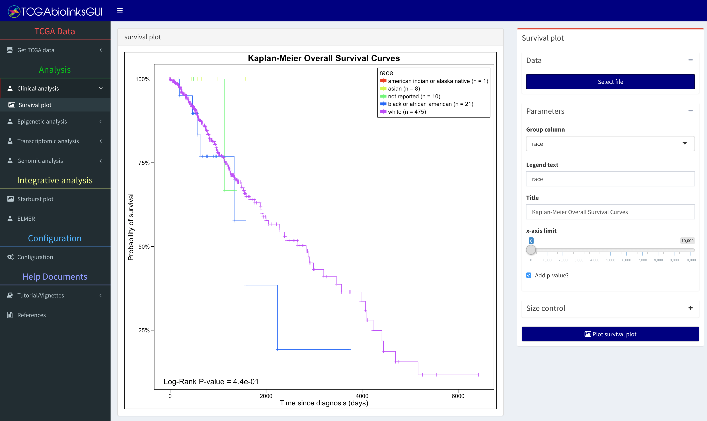
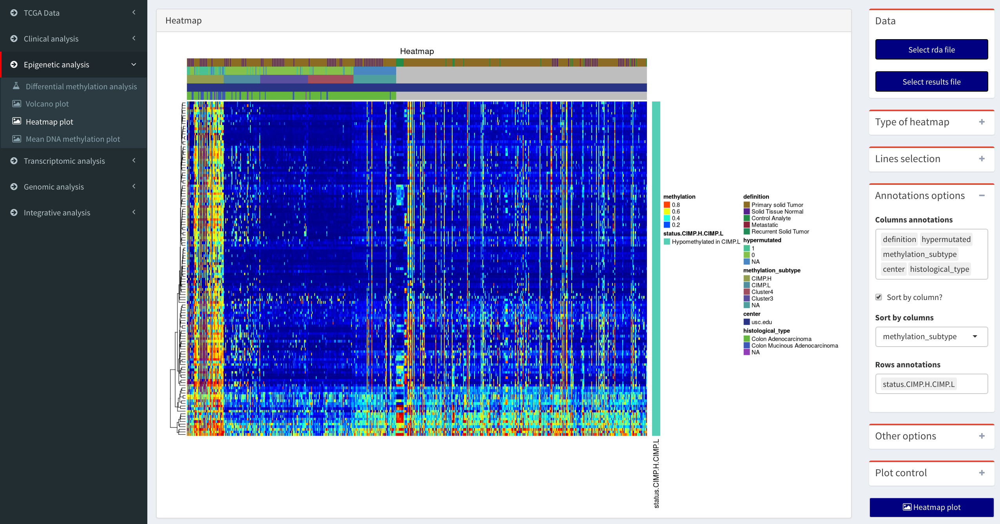
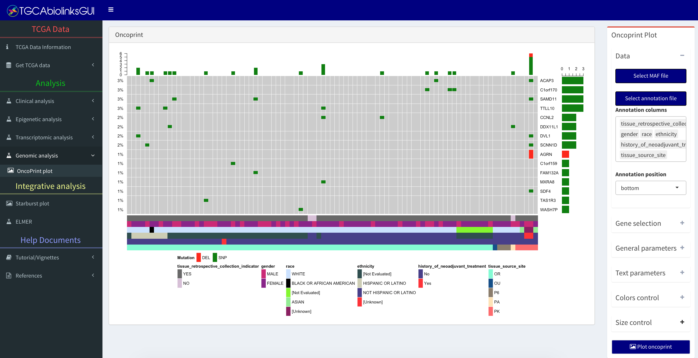

```{r setup, include=FALSE}
knitr::opts_chunk$set(dpi = 600)
```

```{r, echo = FALSE,hide=TRUE, message=FALSE,warning=FALSE}
devtools::load_all(".")
```


# Introduction

TCGAbiolinksGUI was created to help users with limited programming knowledge to search, download and analyze 
TCGA data. This package offers a graphical user interface to the R/Bioconductor package [TCGAbiolinks]( 	http://bioconductor.org/packages/TCGAbiolinks/) [@ref2] and [ELMER](http://bioconductor.org/packages/ELMER/) [@ref4].
Additional packages from Bioconductor are included, such as [ComplexHeatmap](http://bioconductor.org/packages/ComplexHeatmap/) package [@ref1] to aid in visualizing the data.

This vignette is arranged according to the current GUI menu layout. The menus and sub-menus are:

* TCGA Data
    + Get TCGA data
        + Molecular data
        + Mutation data
        + Clinical data
        + Subtype data
    + Manage Summarized Experiment
* Analysis        
    * Clinical analysis
        + Survival plot
    * Epigenetic analysis
        + Differential methylation analysis
        + Volcano plot
        + Heatmap plot
        + Mean DNA methylation plot
    * Transcriptomic analysis
        + Differential expression analysis
        + Volcano plot
        + Heatmap plot
        + Enrichment analysis
    * Genomic analysis
        + Oncoprint Plot
* Integrative analysis
    + Starburst plot
    + ELMER
* Configuration
* Help documents
    + Tutorial/vignettes
    + References

## Install TCGAbiolinksGUI

To install the package from the Biocondcutor repository:

```{r, eval = FALSE}
source("https://bioconductor.org/biocLite.R")
biocLite("TCGAbiolinksGUI")
```

To install the development version of the package via GitHub:

```{r, eval = FALSE}
# dependencies
devtools::install_github("BioinformaticsFMRP/TCGAbiolinks")
source("https://bioconductor.org/biocLite.R")
biocLite(c("pathview","clusterProfiler","ELMER"))
install.packages(c("shiny","readr","googleVis","shinydashboard"))
devtools::install_github("thomasp85/shinyFiles")
devtools::install_github("ebailey78/shinyBS", ref="shinyBS3")
devtools::install_github("daattali/shinyjs")
devtools::install_github("BioinformaticsFMRP/TCGAbiolinksGUI")
```

## Quick start

The following commands should be used in order to start the graphical user interface.

```{r, eval = FALSE}
library(TCGAbiolinksGUI)
TCGAbiolinksGUI()
```

## Citation

Please cite both TCGAbiolinks package and TCGAbiolinksGUI: 

* Colaprico A, Silva TC, Olsen C, Garofano L, Cava C, Garolini D, Sabedot T, Malta TM, Pagnotta SM, Castiglioni I, Ceccarelli M, Bontempi G and Noushmehr H. "TCGAbiolinks: an R/Bioconductor package for integrative analysis of TCGA data." Nucleic acids research (2015): gkv1507.

Other related publication to this package:

* "TCGA Workflow: Analyze cancer genomics and epigenomics data using Bioconductor packages". F1000Research [10.12688/f1000research.8923.1](http://dx.doi.org/doi:10.12688/f1000research.8923.1) [@ref24]

If you used ELMER please cite:

* Yao, L., Shen, H., Laird, P. W., Farnham, P. J., & Berman, B. P. "Inferring regulatory element landscapes and transcription factor networks from cancer methylomes." Genome Biol 16 (2015): 105.
* Yao, Lijing, Benjamin P. Berman, and Peggy J. Farnham. "Demystifying the secret mission of enhancers: linking distal regulatory elements to target genes." Critical reviews in biochemistry and molecular biology 50.6 (2015): 550-573.

If you used OncoPrint plot and Heatmap Plot please cite:

* Gu, Zuguang, Roland Eils, and Matthias Schlesner. "Complex heatmaps reveal patterns and correlations in multidimensional genomic data." Bioinformatics (2016): btw313

If you used Pathway plot please cite:

* Luo, Weijun, Brouwer and Cory (2013). “Pathview: an R/Bioconductor package for pathway-based data integration and visualization.” Bioinformatics, 29(14), pp. 1830-1831.

# GDC Data

## Menu: Get GDC Data

### Sub-menu: Molecular data

In this sub-menu the user can search, download and prepare GDC data.


##### Advanced seach box

Based on the following filters, it will show a table with the following results:

* Database
* Project filter
* Data category filter
* Data type filter
* Workflow filter
* Sample type filter
* List of barcodes
* Clinical filtrer: gender, race, vital status, tumor stage


##### Download & Prepare box

After the search, the user can download the data and prepare it into an R object.
The data can be prepared into one of two formats:

* [Summarized Experiment](http://www.nature.com/nmeth/journal/v12/n2/abs/nmeth.3252.html) 
[@ref3]
* Data Frame

If the Summarized Experiment object is selected, then the subtype and clinical information will be added.
The object will save with the same name as the file name field.

### Sub-menu: Subtype data

The Cancer Genome Atlas (TCGA) Research Network has reported integrated genome-wide 
studies of various diseases. We have added some of the subtypes defined by these
reports in our package. The BRCA [@ref11], COAD [@ref12], GBM [@ref8], HNSC [@ref14], KICH [@ref15], KIRC[@ref21], KIRP [@ref20], LGG [@ref8], LUAD [@ref9], LUSC[@ref16], PRAD[@ref19], READ [@ref12],  SKCM [@ref13], STAD [@ref10], THCA [@ref18], UCEC [@ref17]. In subsequent versions, we will update this list.

The user can visualize the table with the information and save it as csv or an R object (rda) file.

### Sub-menu: Clinical data

Download GDC clinical data

[](http://www.youtube.com/watch?v=54NBug9ycwM "Downloading clinical example")


### Sub-menu: Mutation data
Download the Mutation Annotation Format (MAF)

# Analysis
## Menu: Clinical analysis

### Sub-menu: Survival plot
From the clinical data download in the TCGA data menu, the user can use it to verify the survival of different groups.



##### Data 
A cvs or R object (rda) file with the clinical information.

##### Parameters 

* Group column: Select the column that identifies the group of each sample.
* Legend text: Text of the legend.
* Title: Title text.
* x-axis limit: Limits the x-axis, if 0 no cut-off is considered.
* Add p-value: Add p-value to the plot.

##### Size control
Change the size of the plot

## Menu: Manage summarized Experiment object
[](http://www.youtube.com/watch?v=54rP_yZlpQs  "Downloading clinical example")

## Menu: Epigenetic analysis

### Sub-menu: Differential methylation analysis

The user will be able to perform a Differential methylation regions (DMR) analysis.
The output will be a file with the following pattern: DMR_results_GroupCol_group1_group2_pcut_1e-30_meancut_0.55.csv
Also, the summarized Experiment will be saved with all the results inside it and the new object will be saved with _result suffix.

Obs: Depending on the number of samples and the number of probes of interest, this analysis can last anywhere from minutes to days.  This is also dependent on the type of machine and hardware in which the analysis is running on.


##### Data

Select a summarized Experiment object (rda)

##### Parameters control

* Cores: Selects the number of cores to be used in the analysis
* DNA methylation threshold: minimum difference of DNA methylation levels to be considered as hyper/hypomethylated
* P-value adj cut-off: minimum adjusted P-value to be considered as significant.
* Group column: columns with the groups to be used in the analysis
* Groups: Select at least two groups to the analysis. For example if it has three groups (g1, g2 and g3) the analysis will
output g1 vs g2, g1 vs g3 and g2 vs g3.

### Sub-menu: Volcano plot

In this sub-menu the user will be able to plot the results from Differentially methylated regions (DMR) 
analysis and differential expression analysis (DEA). 


##### Data 
Expected input a csv file with the following pattern:

* For expression: DEA_results_Group_subgruop1_subgroup2_pcut_0.01_logFC.cut_2.csv
* For DNA methylation: DMR_results_Group_subgruop1_subgroup2_pcut_1e-30_meancut_0.55.csv

##### Volcano options
This box will control the x-axis thresholds "Log FC threshold" for expression and "DNA methylation threshold" for DNA methylation and the y-axis thresholds "P-value adj cut-off".


##### Highlighthing options  options

Checkbox option:

* Show names: Show the names of up/down regulated genes or hypo/hyper methylated probes 
* Boxed names: put names inside a box.
To highlight specific genes/probes consider using the "Highlighting option".

The option "points to highlight" can perform the following functions:

* highlighted - show the names for only the highlighted genes/probes list
* significant - show the names for only the up/down regulated genes or hypo/hyper methylated probes 
* both - show both groups

##### Color control
Change the color of the plot

##### Size control
Change the size of the plot

##### Other 

* Save file with results: Create a file with the same pattern as the one in the input, but with the new thresholds.

## Sub-menu: Mean DNA methylation plot

In this sub-menu the user will be able to plot the mean DNA methylation by groups.


##### Data
Expected input is an R object (rda) file with a summarized Experiment object.

##### Parameters control

* Groups column: Select the column that will split the data into groups. 
This column is selected from the  sample matrix (accessed with colData)

* Subgroups column: Select the column that will highlight the different subgroups data in the groups. 
* Plot jitters: Show jitters
* Select y limits: Set lower/upper limits for y
* Sort method: Methods to sort the groups in the plot
* x-axis label angle: Change angle of the text in the x-axis

##### Size control
Change the size of the plot

## Menu: Transcriptomic analysis
In this sub-menu the user will be able to perform a gene ontology enrichment analysis for the following processes:
biological, cellular component, molecular function. In addition, a network analysis for the groups of genes will be performed.

### Sub-menu: Differential expression analysis

##### Gene expression object box

Select a summarized Experiment object (rda)

##### Normalization of genes

* Normalization of genes? Normalize the genes?
* Normalization of genes method? Options: gcContent, geneLength

##### Quantile filter of genes

* Quantile filter of genes?
* DEA test method: quantile, varFilter, filter1, filter2
* Threshold selected as mean for filtering

##### DEA analysis

* Log FC threshold: Log2FoldChange  threshold
* P-value adj cut-off: significant threshold
* Group column: group column in the summarized Experiment object
* Group 1: Group 1 for comparison
* Group 2: Group 2 for comparison
* DEA test method: options glmRT, exactTest

##### Pathway graphs

* DEA result: Select csv file create by the analysis.
* Pathway ID: plot results in a pathway graphs. See bioconductor [pathview](http://bioconductor.org/packages/pathview/) [@ref5] package.


[](http://www.youtube.com/watch?v=MtEVe7_ULlQ "Pathview graphs example")

### Sub-menu: Heatmap plot



##### Data

* Select R object (rda) file: Should receive a summarized Experiment object
* Results file: Should receive the output from the DEA or DMR analysis.

DEA result file should have the following pattern: DEA_result_groupCol_group1_group2_pcut_0.05_logFC.cut_0.csv
DMR result file should have the following pattern:  DMR_results_groupCol_group1_group2_pcut_0.05_meancut_0.3.csv


##### Genes/Probes selection

* By status: Based on the results file the user can select to see hyper/hypo methylated probes
* Text: the user can write a list of genes separated by ";" , "," or a new line

#### Annotation options

* Columns annotation: using the data in the summarized experiment the user can annotate the heatmap.
* Sort by column: The order of the columns can be sorted by one of the selected columns
* Row annotation: Add annotation to rows


#### Other options

* Scale data: option "none", "by row","column"
* Cluster rows ?
* Cluster columns ?
* Show row names ?
* Show col names ?

#### Size control
Change the size of the plot and the number of bars to plot

### Sub-menu: Enrichment analysis

In order to better understand the underlying biological processes, researchers often retrieve a functional profile of a set of genes that might have an important role. This can be done by performing an enrichment analysis.

Given a set of genes that are up-regulated under certain conditions, an enrichment analysis will identify classes of genes or proteins that are over or under-represented using gene set annotations.


#### Gene selection
Input a list of genes by:

* Selection: The user can select by hand multiple genes from a list
* Text: the user can write a list of genes separated by ";" , "," or a new line
* File: select a file (rda, csv, txt) with a column Gene_symbol or mRNA

#### Parameter control

* Size of the text
* x upper limit: x-axis upper limit. If 0 no limit is used.
* Number of bar histogram to show: Maximum number of bars to plot

#### Plot selection

* Plot biological process?
* Plot Cellular Component?
* Plot Molecular function?
* Plot Pathways?

#### Colors control
Change the color of the plot

#### Size control
Change the size of the plot and the number of bars to plot

## Menu: Genomic analysis

### Sub-menu: Oncoprint

Using oncoPrint function from the [ComplexHeatmap](http://bioconductor.org/packages/ComplexHeatmap/) package, this sub-menu offer a way to visualize multiple genomic alteration.



[](http://www.youtube.com/watch?v=cp1AwT8Ogmg "Oncoprint example")

#### Data

* Select MAF file: Select a MAF file (.rda) with mutation annotation information
* Select annotation file: Select an R object (rda)  with the metadata information. Columns "patient" or "bcr_patient_barcode" should exist.
* Annotation columns: Which columns of the annotation file should be visible?
* Annotation position: Location of the annotation? e.g. Top or bottom.

#### Gene selection

* Selection: The user can select multiple genes from a list
* Text: The user can write a list of genes separated by ";" , "," or a new line
* File: Select a file (rda, csv, txt) with a column Gene_symbol or mRNA

#### Parameters control

* Remove empty columns? If a samples has no mutation it will be removed from the plot 
* Show column names? Show patient barcodes
* Show barplot annotation on rows? Show right barplot?

# Integrative analysis

## Menu: Starburst plot


### Data 
Expected input is a csv file with the following pattern:

* DEA result: DEA_results_Group_subgruop1_subgroup2_pcut_0.01_logFC.cut_2.csv
* DMR result: DMR_results_Group_subgruop1_subgroup2_pcut_1e-30_meancut_0.55.csv

### Thresholds control

The possible thresholds controls are:

* Log FC threshold: gene expression Log2FC threshold
* Expression FDR cut-off: gene expression  FDR cut-off (y-axis)
* Mean DNA methylation difference threshold: Mean DNA methylation difference threshold
* Methylation FDR cut-off: DNA methylation FDR cut-off (x-axis)

The options Mean DNA methylation difference threshold and Log FC threshold are used to circle genes which pass the cut-offs previously defined (eg. mean methylation or FDR).

### Highlight control
The possible highlight controls are:

* Show genes names: show names of significant genes
* Boxed names: show names inside a box
* Circle genes: Circle candidate biologically significant genes

### Other option

* Save result: save results in a csv file

### Video:
[](http://www.youtube.com/watch?v=_ec6Sij4MBc "Starburst plot example")


## Menu: ELMER
This sub-menu will help the user to perform an integrative analysis between DNA methylation and Gene expression using the R/Bioconductor ELMER package [@ref4].


### Sub-menu ELMER: analysis
#### Data: Create mee 

ELMER works with a mee object, that has matched DNA methylation and gene expression data and divides the samples into two groups: experiment and control.

* Select DNA methylation object: select a summarized Experiment object with the DNA methylation data
* Select expression object: select a summarized Experiment object with the gene expression data
* Group column: Select the columns with the groups. This column will be selected from the Summarized Experiment object.
* Experiment group: Select the columns with the subgroup 1 (experiment)
* Control group: Select the columns with the subgroup 2 (control)

* DNA methylation: Cut-off NA samples (%): By default, for the DNA methylation data will remove probes with NA values in more than 20% samples and remove the annotation data.

#### Data: Select mee
 Select the R object (rda) file with a mee object created in the previous step.

#### Analysis

This box has all the available option for elmer functions. Please see the ELMER vignette. 

### Sub-menu ELMER: Visualize results
#### DATA

Select the R object (rda) file with ELMER results created in the analysis step.

#### Plot
Select ELMER plot. To access the plots, both the results and mee object must be selected. Please see ELMER vignette for more details. 

#### Results table
Select the ELMER results from the table. A results object should be selected.

# Data input summary
```{r table2, echo=FALSE, message=FALSE, warnings=FALSE, results='asis'}
tabl <- "  
| Menu                    | Sub-menu                          | Button             | Data input  |
|---------------------------------|-----------------------------------|------------------------------------|-----------------------------------------------------------------------------------------------------------------------|
| Clinical analysis       | Profile Plot                      | Select file        | A table with at least two categorical columns  |
| Clinical analysis       | Survival Plot                     | Select file        | A table with at least the following columns: days_to_death, days_to_last_followup and one column with a group |
| Epigenetic analysis     | Differential methylation analysis | Select data (.rda) | A summarizedExperiment object |
| Epigenetic analysis     | Volcano Plot                      | Select results     | A csv file with the following pattern: DMR_results_GroupCol_group1_group2_pcut_1e-30_meancut_0.55.csv  (Where GroupCol, group1, group2 are the names of the columns selected in the  DMR steps. |
| Epigenetic analysis     | Heatmap plot                      | Select file        | A summarizedExperiment object  |
| Epigenetic analysis     | Heatmap plot                      | Select results     | Same as Epigenetic analysis >Volcano Plot > Select results |
| Epigenetic analysis     | Mean DNA methylation              | Select file        | A summarizedExperiment object |
| Transcriptomic Analysis | Volcano Plot                      | Select results     | A csv file with the following pattern: DEA_results_GroupCol_group1_group2_pcut_1e-30_meancut_0.55.csv (Where GroupCol, group1, group2 are the names of the columns selected in the DEA steps. |
| Transcriptomic Analysis | Heatmap plot                      | Select file        | A summarizedExperiment object  |
| Transcriptomic Analysis | OncoPrint plot                      | Select MAF file        | A MAF file (columns needed: Hugo_Symbol,Tumor_Sample_Barcode,Variant_Type) |   |
| Transcriptomic Analysis | OncoPrint plot                      | Select Annotation file        | A file with at least the following columns: bcr_patient_barcode  |    |
|  Integrative analysis   | Starburst plot                      | DMR result        | A csv file with the following pattern: DMR_results_GroupCol_group1_group2_pcut_1e-30_meancut_0.55.csv (Where GroupCol, group1, group2 are the names of the columns selected in the DMR steps.  |
|  Integrative analysis   | Starburst plot                      | DEA result        | A csv file with the following pattern: DEA_results_GroupCol_group1_group2_pcut_1e-30_meancut_0.55.csv (Where GroupCol, group1, group2 are the names of the columns selected in the DEA steps.  |
|  Integrative analysis   | ELMER                      | Create mee > Select DNA methylation object         | An rda file with a sumarized Exepriemnt object |   
|  Integrative analysis   | ELMER                      | Select results > Select expression object         |  An rda file with the RNAseq data frame |   
|  Integrative analysis   | ELMER                      | Select mee         | An rda file with a mee object |   
|  Integrative analysis   | ELMER                      | Select results         | An rda file with the results of the ELMER analysis |   
"
cat(tabl) 
```

# Cases of study 

## Case 3
[](http://www.youtube.com/watch?v=RcXibjFanH4 "Case study 3")

## Case 4
[](http://www.youtube.com/watch?v=EhGw1aF-2_c "Case study 4")

# Session info
```{r sessionInfo, results='asis', echo=FALSE}
sessionInfo()
```

# References
